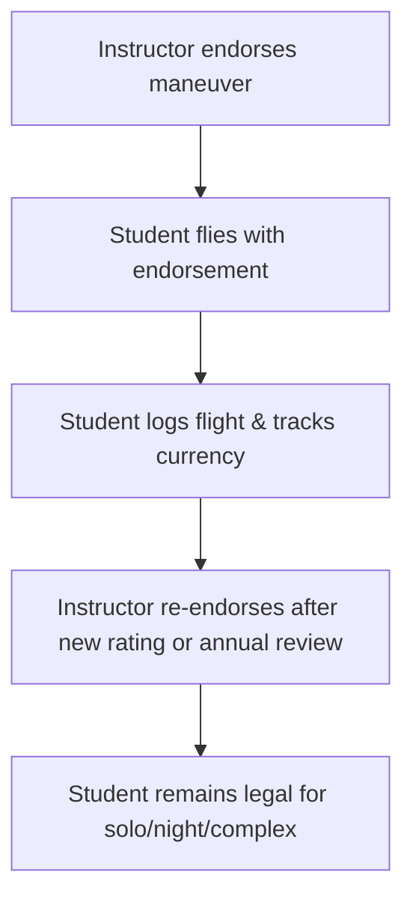

# Endorsements & Currency

## What it is
Endorsements are instructor-authorized statements required before you conduct specific operations (solo, night, complex, high-performance). Currency is the self-check against those endorsements, ensured by logbook entries and periodic proficiency.

## Why it matters
A DPE will ask for endorsements before you fly solo or take off after the checkride. Lacking one is a regulatory failure, not a training oversight.

## How it shows up on a checkride
- **Q:** “What endorsement do you need before a solo cross-country?” **A:** A logbook endorsement covering the specific course, airplane, and limitations per FAR 61.87.
- **Q:** “How do you stay current for passengers?” **A:** Within the past 90 days, three takeoffs and landings in the same category/class; night passengers also require night landings (FAR 61.57).
- **Q:** “What endorsement is required to fly a complex or high-performance airplane?” **A:** Instructor endorsement per FAR 61.31.

## Common mistakes
- Forgetting to recheck endorsements after a lesson—endorsements expire when the training rating or syllabus changes.
- Logging a solo or night flight without explicitly noting the endorsement and the date.
- Believing currency applies to the aircraft model instead of the category/class (e.g., you must be current in another Cessna, not necessarily the exact serial number).

## Diagram

## ACS Tags
- Area of Operation: Preflight Preparation (PA.III)
- Task(s): PA.III.A Explain required endorsements, PA.III.C Describe currency requirements for passengers.
- Knowledge elements: FAR 61.31 endorsement rules, FAR 61.57 currency, logbook documentation.

## References
- PHAK Ch 1 Endorsements, certificates, and AMS.
- FAR 61.31 Training endorsement requirements.
- FAR 61.57 Recent flight experience for carrying passengers.
- FAR 61.87 Solo requirements for student pilots.
