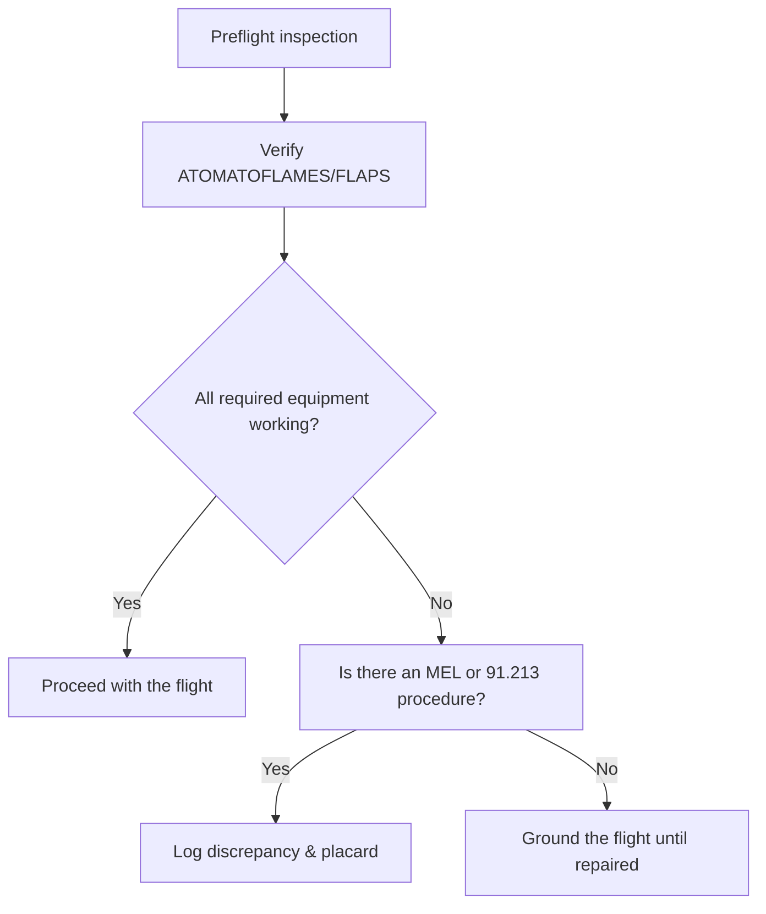

# Equipment Requirements & INOP Equipment

## What it is
FAR 91.205 mandates the instruments and equipment needed for VFR flight (ATOMATOFLAMES for day, FLAPS for night). FAR 91.213 explains how to fly with inoperative instruments when the equipment list and procedures allow it.

## Why it matters
You need to show the DPE you can articulate the required equipment, cross-check the POH, and apply the INOP procedure before you ever taxi the airplane—this keeps you legal and avoids scenarios where a broken gauge grounds the flight needlessly.

## How it shows up on a checkride
- **Q:** “What does ATOMATOFLAMES stand for?” **A:** Altimeter, Tachometer, Oil pressure gauge, Manifold pressure (if applicable), Airspeed indicator, Temperature gauge (liquid-cooled), Oil temperature gauge, Fuel gauges, Landing gear position lights (if retractable), Anti-collision lights, Magnetic compass, Emergency locator transmitter, Seat belts.
- **Q:** “What do you do if the TO/GA indicator is inop?” **A:** Consult FAR 91.213(d), the aircraft’s MEL (if it has one), or the POH to determine whether the flight can continue; document the issue and ensure a mechanic returns it to service.
- **Q:** “When can you defer equipment?” **A:** Under FAA-approved maintenance documentation (like a minimum equipment list) or under 91.213(d) after verifying the equipment is not required for day VFR and logging the discrepancy.

## Common mistakes
- Turning on the master and flying with known INOP equipment without documenting it (logbook entry per FAR 91.405).
- Assuming all equipment in the panel is required; focus on ATOMATOFLAMES for day and FLAPS for night operations.
- Forgetting to review the POH/AFM for any additional limitations beyond FAR 91.205.

## Diagram

## ACS Tags
- Area of Operation: Preflight Preparation (PA.II)
- Task(s): PA.II.A Determine equipment requirements and procedures for INOP items.
- Knowledge elements: ATOMATOFLAMES/FLAPS mnemonic, FAR 91.205, FAR 91.213 INOP handling.

## References
- FAR 91.205 Required instruments and equipment.
- FAR 91.213 Replacing instruments/equipment with inop items and special flight permits.
