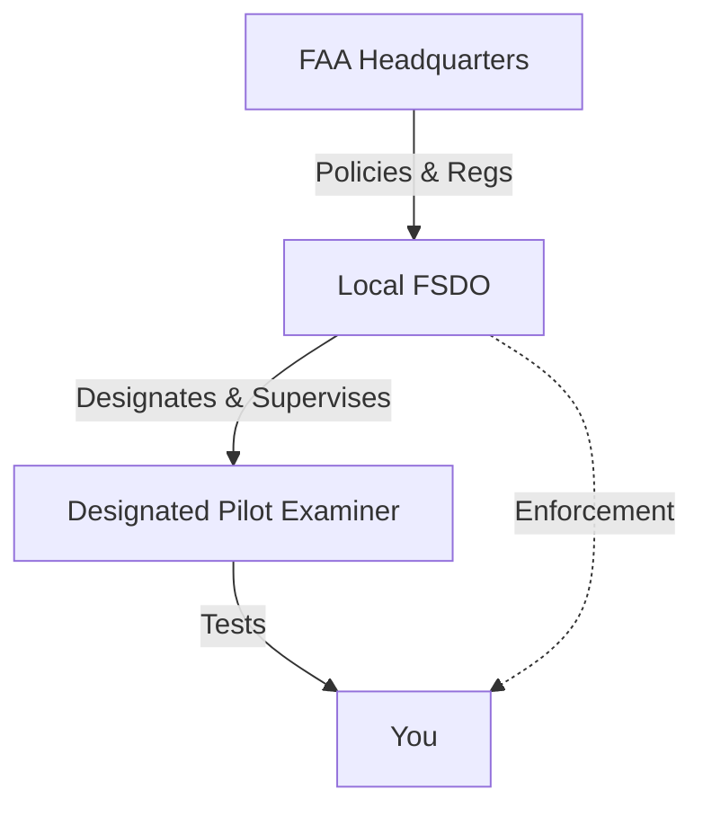

# FAA, FSDO, & DPE Roles

## Definition
The ecosystem of people and agencies that govern your flying.

## The Players

### 1. FAA (Federal Aviation Administration)
The "Big Boss." They write the rules (FARs) and oversee the National Airspace System.

### 2. FSDO (Flight Standards District Office)
The "Local Branch."
- Local FAA field office.
- Handles accidents, violations, and low-flying complaints.
- Historically conducted checkrides, but now mostly delegate to DPEs.

### 3. DPE (Designated Pilot Examiner)
The "Contractor."
- A senior pilot authorized by the FAA to conduct checkrides (practical tests).
- They are **not** FAA employees; they are private individuals designated to act on the FAA's behalf.
- They charge a fee for their service.

## Why It Matters
- You will take your checkride with a DPE.
- If you have an accident or incident, you will deal with the FSDO.

## Checkride Angle
- The DPE is "God" on checkride day. Their word is final regarding the test outcome (Pass/Fail/Discontinuance).
- However, they must follow the **ACS (Airman Certification Standards)**. They cannot make up their own rules.

## Diagram: Authority Flow

## Study Drills
1. Can a DPE suspend your license? (No, only the FAA/FSDO can initiate enforcement).
2. Who do you call if you need a "Special Issuance" medical? (Start with your AME, who works with the FAA Aerospace Medical Certification Division).

## References
- PHAK Chapter 1
- FAR Part 183 (Representatives of the Administrator)
