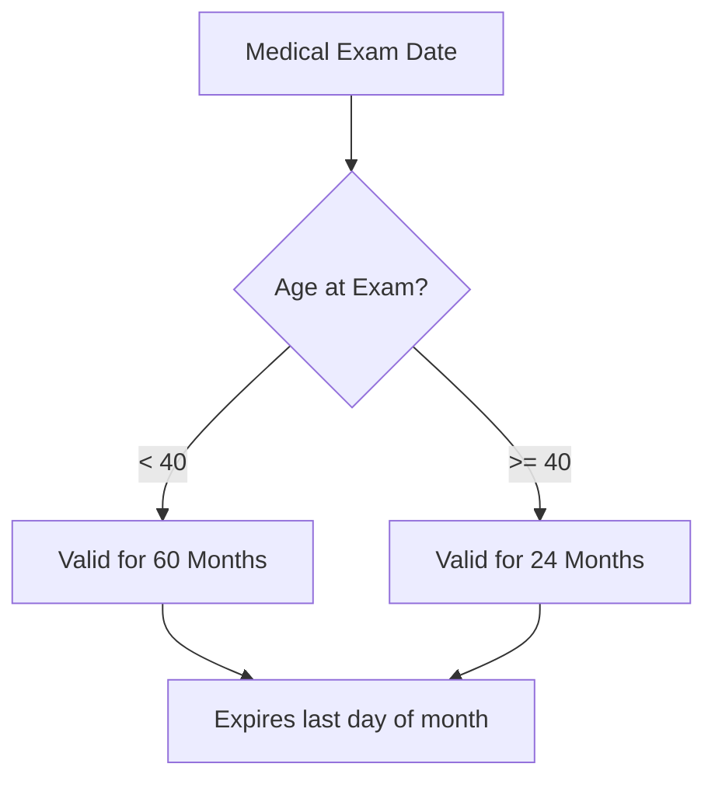

# Medical Certificates & BasicMed

## Definition
A document issued by an Aviation Medical Examiner (AME) stating you meet the physical standards to fly.

## Why It Matters
Without a valid medical (or BasicMed), your pilot certificate is essentially grounded for acting as PIC (Pilot in Command).

## Classes & Durations (Under Age 40 / Age 40+)
*Note: Durations are calculated to the end of the month of examination.*

| Class | Primary Use | Under 40 | 40 and Over |
| :--- | :--- | :--- | :--- |
| **1st** | Airline Transport Pilot (ATP) | 12 months | 6 months |
| **2nd** | Commercial Pilot | 12 months | 12 months |
| **3rd** | Private / Student / Rec | 60 months (5 yrs) | 24 months (2 yrs) |

> [!NOTE] Privilege Downgrade
> If your 1st Class medical "expires" after 12 months, it doesn't become void. It **reverts** to 3rd Class privileges for the remainder of the 5-year (or 2-year) period.

## BasicMed
An alternative to holding a 3rd class medical.
- **Requirements:** valid US driver's license, held a medical after July 14, 2006, complete CMEC exam (every 48 months), take online course (every 24 months).
- **Limitations:** Max 6 seats, max 6,000 lbs TOW, max 250 kts, VFR/IFR ok, <18,000 MSL.

## Checkride Angle
- **Scenario:** "You are 42 years old. You got a 3rd class medical 25 months ago. Can you fly as PIC today?"
- **Answer:** No. Over 40, the 3rd class is valid for 24 months. It expired at the end of the month last month.

## Common Mistakes
- Thinking the medical certificate physically changes color or text when it "downgrades." It's the same piece of paper; the *privileges* change.
- Forgetting the "end of the month" rule.

## Diagram: Duration Logic

## Study Drills
1. If a 35-year-old gets a 1st Class Medical, how long can they exercise ATP privileges? How long for Private privileges?
2. What happens if you lose your medical certificate?
3. Can you fly if you have a known medical condition, even if your certificate is technically unexpired? (Hint: FAR 61.53)

## References
- FAR 61.23 (Medical certificates: Requirement and duration)
- FAR 68 (BasicMed)
- PHAK Chapter 1
