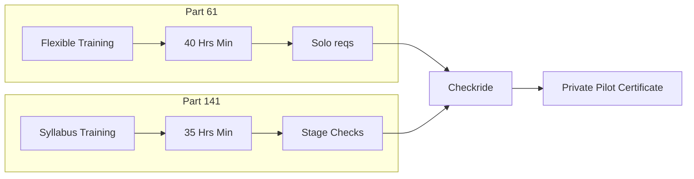

# Part 61 vs. Part 141 Training

## Definition
Two different sets of regulations under which you can learn to fly.
- **Part 61:** Flexible, lesson-by-lesson, adaptable to schedule. "Mom & Pop" style (though big schools use it too).
- **Part 141:** Structured, FAA-approved syllabus, strict stage checks. "University/Academy" style.

## Why It Matters
It changes the minimum flight hour requirements for your license, though in reality, most students finish with similar hours (60-70 hours) regardless of the path.

## Key Differences (PPL Airplane)

| Feature | Part 61 | Part 141 |
| :--- | :--- | :--- |
| **Structure** | Flexible; CFI tailors to student | Strict; must follow approved syllabus |
| **Min Total Hours** | 40 hours | 35 hours |
| **Oversight** | CFI signs you off | Stage checks by Chief Pilot required |
| **Best For** | Part-time students, irregular schedules | Career track, full-time students, GI Bill |

## Checkride Angle
- The DPE usually doesn't care *how* you got there, as long as you meet the requirements for the path you took.
- **Note:** If you switch schools (141 to 61), usually all hours count. 141 to 141 is harder (credit transfer).

## Common Mistakes
- Thinking Part 141 is "better." It's just more structured.
- Thinking you will definitely finish in 35 hours under Part 141. (Almost no one does).

## Diagram: The Paths

## Study Drills
1. Which part allows for a Private Pilot license with fewer flight hours?
2. If you start in Part 141 and quit halfway, can you finish under Part 61?

## References
- FAR Part 61
- FAR Part 141
- PHAK Chapter 1
