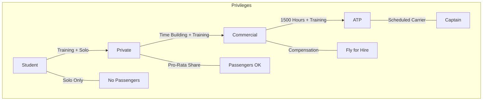

# Pilot Certificates Hierarchy

## Definition
The FAA issues pilot certificates at different "grade" levels. Each level grants specific **privileges** and imposes specific **limitations**.

## Why It Matters
You need to know what you are legally allowed to do. Can you carry passengers? Can you fly for money? Can you fly in clouds?

## Hierarchy Levels

1.  **Student Pilot:** Learning to fly. Solo only with endorsements. No passengers.
2.  **Sport/Recreational:** Limited privileges (smaller aircraft, range restrictions).
3.  **Private Pilot:** "License to learn." Carry passengers, pro-rata share of expenses, charitable events. **NO flying for compensation or hire** (with very specific exceptions).
4.  **Commercial Pilot:** Can fly for compensation or hire (subject to Part 119/135 rules).
5.  **Airline Transport Pilot (ATP):** Highest level. Required for scheduled airline captains.

## Checkride Angle
- **Scenario:** "A friend offers you $50 to fly them to lunch. Can you take it?"
- **Answer:** No. That is compensation. You can split the direct operating costs (fuel, oil, airport fees) pro-rata (evenly). You cannot make a profit or even fly for free if the flight serves a business purpose you are involved in (mostly).

## Common Mistakes
- Confusing **Commercial Pilot** privileges with **Commercial Operator** rules. Just because you have a Commercial license doesn't mean you can start "Joe's Airlines."
- Thinking a Private Pilot can *never* be paid. (Exceptions: Glider towing, sales demo, flight instruction *if* CFI, etc., but stick to the "Pro-Rata" rule for PPL basics).

## Diagram: The Ladder

## Study Drills
1. Does a Private Pilot certificate expire?
2. What are the specific exceptions where a PPL can be paid?
3. What is the minimum age for a Private Pilot (Airplane)?

## References
- PHAK Chapter 1
- FAR 61.113 (Private Pilot Privileges and Limitations)
