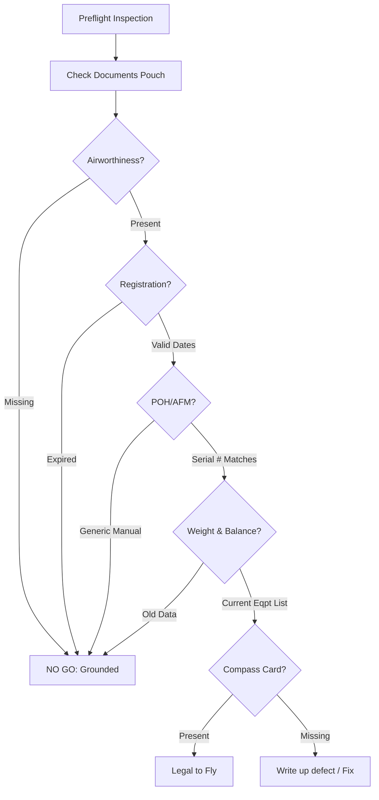

# Required Documents (ARROW)

## 1. The Big Mnemonic: ARROW
*You must be able to physically touch these documents in the airplane.*

| Letter | Document | Validity / Expiration |
| :--- | :--- | :--- |
| **A** | **Airworthiness Certificate** | **Valid Forever** (as long as the aircraft is maintained according to FARs and Airworthiness Directives). Must be visible to passengers. |
| **R** | **Registration Certificate** | **Expires every 3 or 7 years** (check the date). Shows ownership. |
| **R** | **Radio Station License** | **International Only** (Required if flying to Canada/Mexico/Bahamas). Not required for domestic US flights. |
| **O** | **Operating Limitations** | **The POH/AFM specific to THIS serial number.** Also includes placards (markings on instruments) and markings. |
| **W** | **Weight & Balance** | Must be **current** and specific to this aircraft (not a generic example). Includes the empty weight and moment. |

> [!TIP] **Don't Forget the Compass Card!**
> While not in ARROW, a **Compass Deviation Card** is legally required under FAR 23.1547.

---

## 2. POH vs. "Owner's Manual"
*   **The Problem:** Students often buy a generic Cessna 172 manual online.
*   **The Law:** FAR 91.9 says you must comply with the operating limitations *in the approved flight manual*.
*   **The Reality:** The official POH/AFM (Approved Flight Manual) is the one **with the aircraft serial number on it**. It contains the specific weight and balance data and installed equipment list for *that* specific tail number.
*   **Can I use an iPad?** You can use an iPad for reference, but the **Paper POH (or authorized digital replacement)** that came with the plane must be on board.

---

## 3. The "Two As"
Don't confuse the **Airworthiness Certificate** with **Airworthiness Directives (ADs)**.
*   **Certificate:** The paper on the wall. Says "This plane was built correctly."
*   **Directives:** Mandatory recall notices from the FAA. You must comply with them to keep the *Certificate* valid.

---

## 4. Where are they?
*   **A & R:** Usually in a clear plastic pocket on the sidewall near the pilot's left knee (or near the door). *Must be visible to passengers/crew.*
*   **O & W:** In the binder or book usually kept in the seatback pocket or glovebox.

---

## 5. Visualizing the Check

---

## 6. Oral Exam / Checkride Scenarios

**Q1: "Does the Airworthiness Certificate ever expire?"**
> **A:** No, not as long as the aircraft is kept in an airworthy condition (inspections done, ADs complied with). If you skip an Annual, the certificate isn't "expired," but it is **invalid** until the inspection is done.

**Q2: "I lost my POH. Can I just buy a new one from Sporty's and put it in the plane?"**
> **A:** No. You can buy a generic *information manual*, but the official AFM must be ordered from the manufacturer and identified with the aircraft's **Serial Number**. It also needs the specific Weight & Balance sheet inserted.

**Q3: "Where must the Airworthiness Certificate be located?"**
> **A:** It must be displayed at the cabin or cockpit entrance so it is legible to passengers or crew (FAR 91.203).

**Q4: "Is a Radio Station License required?"**
> **A:** Not for operations solely within the US. It is required if you fly internationally (e.g., to Canada or the Bahamas) or if the plane weighs >12,500 lbs (unlikely for a trainer).

**Q5: "You check the Registration and it says 'Issued: 01/01/2020'. Is it valid today (Jan 2026)?"**
> **A:** Maybe. Registrations issued after 2010 expire after **7 years**. Prior to that, it was 3 years. I need to look for the specific "Expiration Date" on the document, not just the issue date. (If issued in 2020, it likely expires in 2027, so it is valid).

---

## References
*   **FAR 91.203:** Certifications required.
*   **FAR 91.9:** Operating Limitations.
*   **FAR 23.1547:** Magnetic Direction Indicator.
