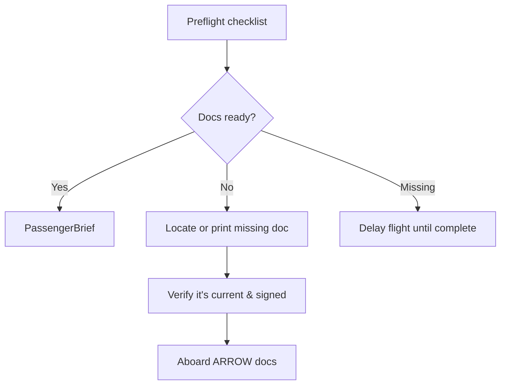

# Required Documents (ARROW)

## What it is
ARROW is the mnemonic that captures the documents you must have on board for every part 91 flight: Airworthiness certificate, Registration certificate, Radio station license (if required), Operating limitations (POH/placards), and Weight & balance data.

## Why it matters
A DPE will ask you to prove you know what has to stay with the airplane and why it matters if any piece is missing—missing paperwork equals an automatic grounding under FAR 91.203.

## How it shows up on a checkride
- **Q:** “What documents are required in the airplane for a VFR cross-country?” **A:** ARROW: airworthiness, registration, radio license (if outside U.S.), operating limitations, and weight & balance; also check the POH for additional placards.
- **Q:** “Where do you keep the weight & balance data?” **A:** With the aircraft’s operating limitations or approved manual, and it must reflect the current configuration.
- **Q:** “Is the radio license required for domestic flights?” **A:** Not typically; it’s only needed when operating internationally or when the radio is required by regulation.

## Common mistakes
- Leaving the registration certificate in the owner’s home rather than the aircraft.
- Forgetting that the POH or AFM containing placards counts as the operating limitations.
- Assuming digital copies suffice—FAA expects the certs to be on board in the approved format unless allowed by the FAA.

## Diagram

## ACS Tags
- Area of Operation: Preflight Preparation (PA.I)
- Task(s): PA.I.A Recall required documents and verify currency before flight.
- Knowledge elements: ARROW items, POH/placard relation, registration/airworthiness validity.

## References
- FAR 91.203 Civil aircraft: Airworthiness certificates.
- FAR 91.205 Required instruments and equipment (operating limitations).
