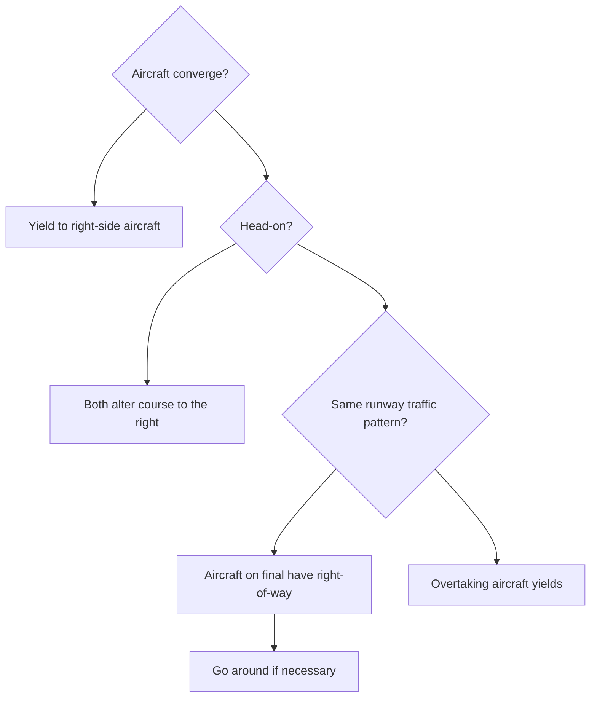

# Right-of-Way Rules (FAR 91.113)

## What it is
FAR 91.113 lays out the order of operations when two aircraft are converging, approaching head-on, or operating in the traffic pattern; the key is yield to the aircraft that has priority and avoid collisions.

## Why it matters
Being able to recite and apply the right-of-way hierarchy proves you can fly defensively and expect other pilots to do the same, which keeps everyone safe in busy airspace.

## How it shows up on a checkride
- **Q:** “Who has the right-of-way when two aircraft are converging at the same altitude?” **A:** The aircraft to the other's right has the right-of-way; the other should give way.
- **Q:** “Who yields in the traffic pattern?” **A:** Aircraft on final have the right-of-way, then aircraft on base, then downwind. The overtaking aircraft must stay above and well clear.
- **Q:** “What do you do if you're on final and another airplane enters your runway?” **A:** Go around to avoid a conflict.

## Common mistakes
- Fixating on your flight instead of scanning and expecting the other pilot to yield automatically.
- Letting a faster plane overtake you by descending into its path; instead, allow it to pass overhead or increase spacing vertically.
- Forgetting that balloons and gliders have priority over powered aircraft in most cases.

## Diagram

## ACS Tags
- Area of Operation: Maneuvering (P.II)
- Task(s): P.II.A Demonstrate knowledge of right-of-way priorities and collision avoidance.
- Knowledge elements: FAR 91.113 hierarchy, traffic pattern responsibilities, go-around decision.

## References
- FAR 91.113 Right-of-way rules.
