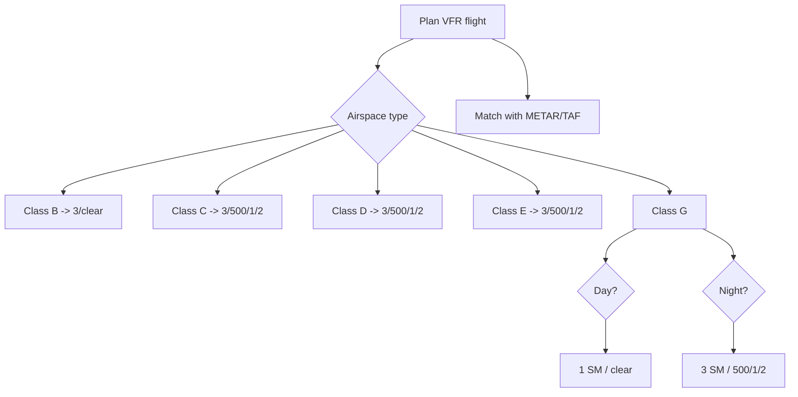

# VFR Weather Minimums Overview

## What it is
FAR 91.155 defines the visibility and cloud clearance requirements for VFR operations in each type of airspace during the day and night.

## Why it matters
Understanding these minimums keeps you legal and safe; the DPE will test whether you can recall the requirements for the airspace you plan to enter and whether the forecast supports VFR.

## How it shows up on a checkride
- **Q:** “What are the VFR minima in Class G below 1,200 feet AGL during the day?” **A:** 1 SM visibility and clear of clouds.
- **Q:** “What’s required in Class E or Class G above 1,200 feet AGL but below 10,000 feet MSL?” **A:** 3 SM visibility, 500 feet below, 1,000 feet above, and 2,000 feet horizontally from clouds.
- **Q:** “How do the minima change at night?” **A:** Night minima are stricter: at least 3 SM visibility and 500/1,000/2,000 feet in Class G; Class B/C/D/E follow the same as daytime but always 3 SM.

## Common mistakes
- Applying Class B clearance requirements to Class E or forgetting to double-check the airspace floor before referencing the chart.
- Reading a METAR cloud layer as indicative of the entire flight without knowing whether the reported altitude is AGL or MSL.
- Ignoring night minimums in Class G by assuming day and night conditions are identical.

## Diagram

## Weather table

| Airspace | Visibility (SM) | Cloud Clearance | Notes |
| --- | --- | --- | --- |
| Class B | 3 | Clear of clouds | Special VFR requires ATC clearance |
| Class C | 3 | 500 below / 1,000 above / 2,000 horizontal | Two-way comms required |
| Class D | 3 | 500 / 1,000 / 2,000 | Must remain within Class D ceiling unless otherwise cleared |
| Class E | 3 | 500 / 1,000 / 2,000 | Applies above 10,000 ft MSL: 5 SM, 1,000 above, 1,000 below, 1 SM horizontal |
| Class G day <1,200 AGL | 1 | Clear of clouds | Applies up to 1,200 AGL; night = 3/500/1/2 |
| Class G day >1,200 AGL | 1 | 500 / 1,000 / 2,000 | Night = 3 / 500 / 1,000 / 2,000 |

## ACS Tags
- Area of Operation: Weather (W.I)
- Task(s): W.I.A Apply VFR weather minima to flight planning.
- Knowledge elements: FAR 91.155 visibility/cloud rules, night differences, special VFR considerations.

## References
- FAR 91.155 Basic VFR weather minimums.
