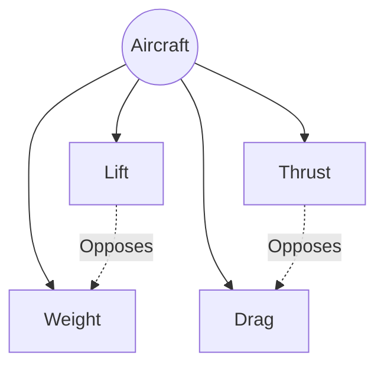

# The Four Forces

## Definition
The fundamental forces acting on an aircraft in flight.

1.  **Lift:** Acts perpendicular to the relative wind. Opposes weight.
2.  **Weight:** Acts downward toward the center of the earth. Opposes lift.
3.  **Thrust:** Forward force produced by the powerplant. Opposes drag.
4.  **Drag:** Rearward retarding force. Opposes thrust.

## Steady State Flight
**Crucial Concept:** In unaccelerated flight (straight and level, constant speed), the forces are **in equilibrium**.
- Lift = Weight
- Thrust = Drag

> [!WARNING] Misconception
> Lift does *not* have to exceed weight to climb. Excess *Thrust* is what allows a climb (by vectoring lift/thrust upwards). In a steady climb, Lift is actually slightly *less* than Weight (because Thrust carries some of the load).

## Diagram: Force Vectors

## Checkride Angle
- **Question:** "In a steady climb, is Lift greater than Weight?"
- **Answer:** No. Forces are in equilibrium (sum of vectors is zero). Weight is supported by the vertical component of Lift *and* the vertical component of Thrust.

## Study Drills
1. When are the four forces equal? (Steady, straight, level, unaccelerated flight).
2. What force makes the airplane turn? (The Horizontal Component of Lift).

## References
- PHAK Chapter 4
