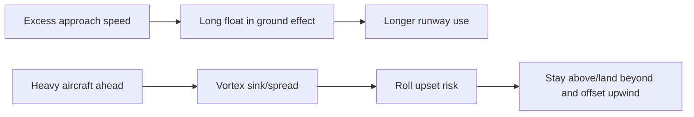

# Ground Effect & Wake Turbulence

## What it is
Ground effect reduces induced drag when flying close to the surface. Wake turbulence is rotating air from lifting wings, strongest behind heavy, clean, slow aircraft.

## Why it matters
Ground effect explains float on landing and delayed climb after takeoff. Wake turbulence avoidance is a high-priority safety item in pattern and terminal operations.

## Checkride angle
- Ground effect is strongest within about one wingspan of the surface.
- Expect longer float in landing flare, especially with excess airspeed.
- For wake avoidance: rotate before larger aircraft's rotation point and land beyond its touchdown point.

## Common mistakes
- Carrying extra approach speed and floating far down the runway.
- Climbing directly through a heavy jet's flight path.
- Assuming light winds remove wake risk near the runway.

## Diagram

## References
- FAA-H-8083-25C PHAK, Chapter 5.
- AIM wake turbulence guidance (Section 7).
