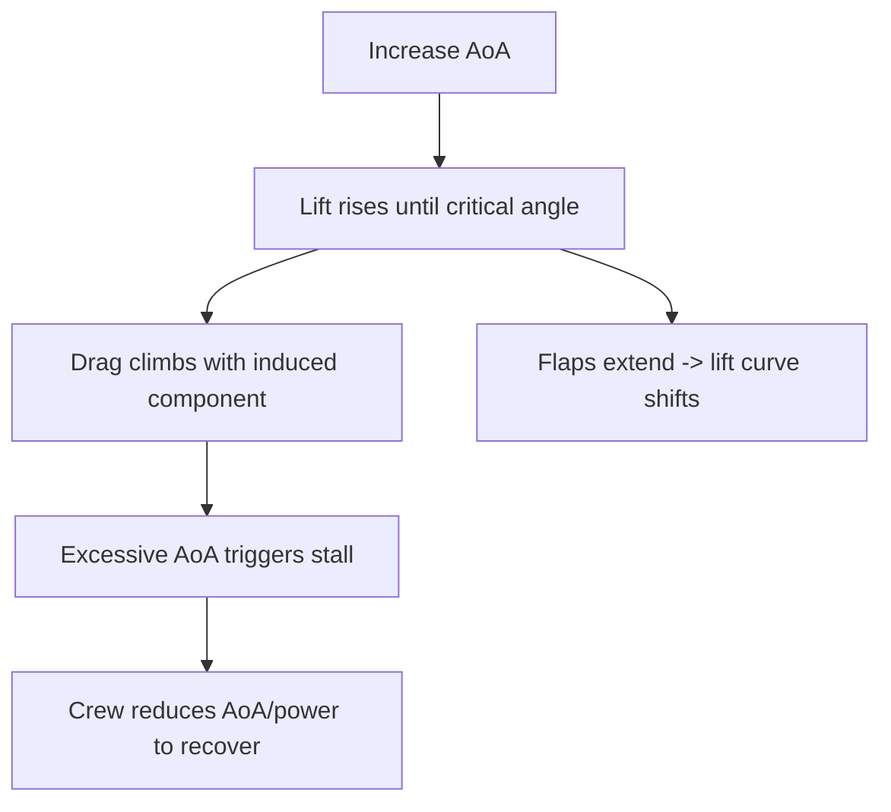

# Lift & Drag Dynamics

## What it is
Lift is the upward force generated by an airfoil, while drag resists forward motion. The balance between them changes as airspeed and angle of attack shift, dictating climb, cruise, and approach performance.

## Why it matters
DPEs expect you to link lift/drag changes to practical decisions: what happens in ground effect, why you need extra airspeed in a crosswind, and how drag spikes during flaps or landing gear deployment.

## How it shows up on a checkride
- **Q:** “How does angle of attack change lift and drag?” **A:** Increasing AoA raises lift until the critical angle; drag climbs exponentially above that point.
- **Q:** “Why is ground effect important on final?” **A:** It reduces induced drag, making the airplane float; you need to bleed off speed and respect flare timing.
- **Q:** “What happens to the lift-to-drag ratio as you add flaps?” **A:** Effective lift increases but parasitic drag rises faster, shifting the best L/D point lower.

## Common mistakes
- Treating lift as a fixed number rather than a response to speed, attitude, and configuration.
- Ignoring the drag penalty when extending flaps near the horizon and expecting a smooth pitch response.
- Forgetting to manage pitch and power together; adding power without raising nose can bury the airspeed indicator.

## Diagram

## ACS Tags
- Area of Operation: Performance and Maneuvering (P.I)
- Task(s): P.I.A Describe aerodynamic forces affecting lift and drag.
- Knowledge elements: Lift production, drag types, effect of configuration changes.

## References
- PHAK Ch 5 Aerodynamics of Flight (forces, lift/drag ratios, flaps).
- PHAK Ch 4 Principles of Flight (pressure, airfoil behavior).
