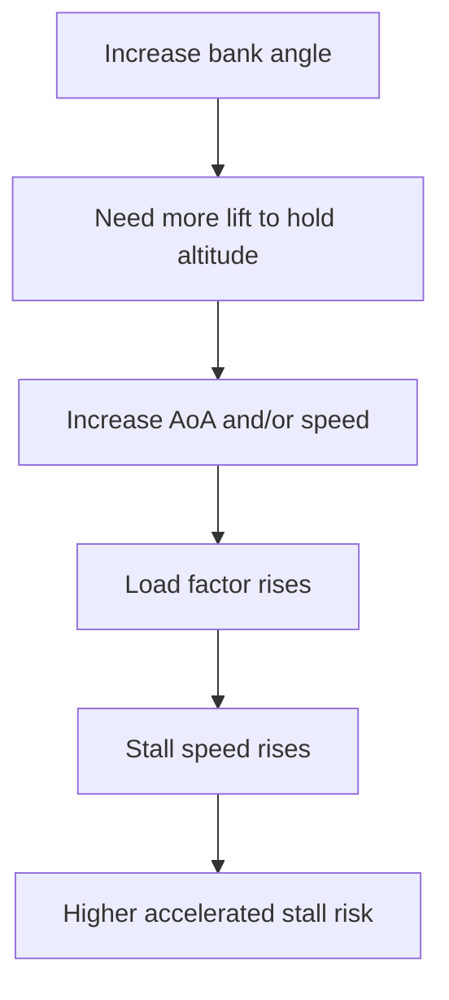

# Load Factor & Maneuvering

## What it is
Load factor is the ratio of lift to aircraft weight, expressed in Gs. In level turns, steeper bank angles require more lift, which increases load factor and stall speed.

## Why it matters
The checkride expects you to connect bank angle, G loading, stall speed increase, and structural limits. This is central to avoiding accelerated stalls.

## Quick numbers
- 45 degrees bank in level flight: about 1.4 G.
- 60 degrees bank in level flight: 2.0 G.
- Higher load factor increases stall speed by the square root of G.

## Checkride angle
If an aircraft stalls at 50 KIAS at 1 G, then at 2 G stall speed is about 71 KIAS.

## Common mistakes
- Thinking stall speed is fixed regardless of maneuver.
- Pulling through turns while slow and close to the ground.
- Ignoring turbulence-induced G spikes near maneuvering speed.

## Diagram

## References
- FAA-H-8083-25C PHAK, Chapter 5.
- FAA-H-8083-3C AFH, maneuvering and stall awareness sections.
