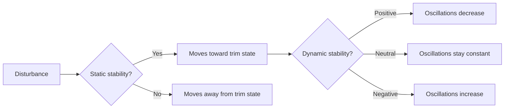

# Stability & Control Axes

## What it is
Airplanes move around three axes: longitudinal (roll), lateral (pitch), and vertical (yaw). Stability describes whether the airplane tends to return to trimmed flight after a disturbance.

## Why it matters
Most loss-of-control events begin with poor axis management and delayed correction. On a checkride, you need to explain what each control surface changes and how stability helps or hurts recovery.

## Checkride angle
- Roll is controlled primarily by ailerons around the longitudinal axis.
- Pitch is controlled primarily by elevator/stabilator around the lateral axis.
- Yaw is controlled primarily by rudder around the vertical axis.
- Static stability: initial tendency to return.
- Dynamic stability: long-term response (damping vs divergence).

## Common mistakes
- Using aileron alone to correct yaw in slow flight.
- Confusing pitch attitude with angle of attack.
- Assuming all trainer aircraft have identical stability behavior.

## Diagram

## References
- FAA-H-8083-25C PHAK, Chapters 4-5.
