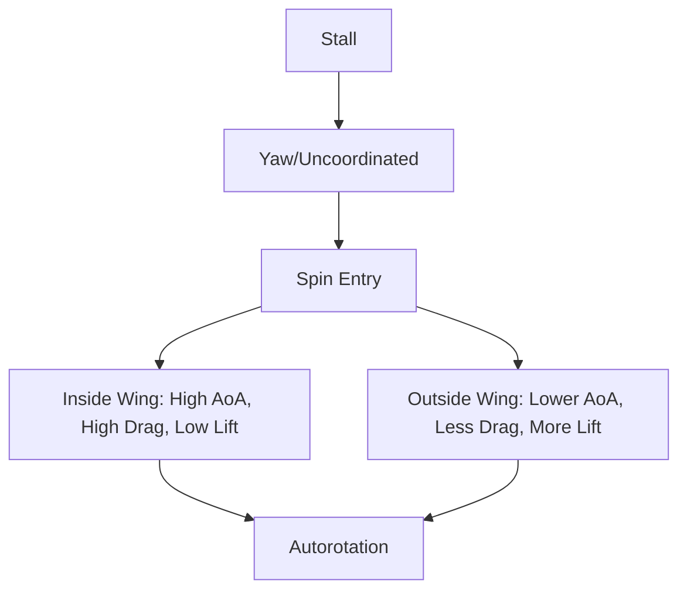

# Stalls, Spins, & Critical AoA

## Stalls
**Definition:** A stall occurs when the smooth airflow over the wing separates from the upper surface, resulting in a rapid loss of lift.
**Cause:** Exceeding the **Critical Angle of Attack**.
**Key Fact:** An aircraft can stall at **any airspeed**, in **any attitude**, and at **any power setting**.

## The Critical Angle of Attack
- Usually around 16°-18°.
- It is a design characteristic of the wing. It does *not* change with weight or speed.

## Spins
**Definition:** An aggravated stall resulting in autorotation.
**Requirements:**
1.  The aircraft must be stalled.
2.  The aircraft must be uncoordinated (Yaw present).

**One wing is "more stalled" than the other.** The inside wing produces less lift and more drag.

## Recovery Procedures

### Stall Recovery
1.  **Disconnect** Autopilot.
2.  **Push:** Lower the nose (Reduce AoA). *This is the most critical step.*
3.  **Roll:** Wings level.
4.  **Power:** Add power to minimize altitude loss (after AoA is reduced).

### Spin Recovery (PARE)
1.  **P**ower: Idle (Power makes the spin flatter/faster in most trainers).
2.  **A**ilerons: Neutral (Ailerons can aggravate the spin).
3.  **R**udder: Full opposite to the direction of rotation.
4.  **E**levator: Briskly forward to break the stall.
5.  *Recover from the dive.*

## Checkride Angle
- **Scenario:** "We are in a steep turn and I pull back hard. The plane shudders at 90 knots. Are we stalling?"
- **Answer:** Yes. That is an accelerated stall. Speed doesn't matter; AoA does.

## Diagram: Spin Dynamics

## Study Drills
1. What is the only cause of a stall? (Exceeding Critical AoA).
2. Why is power idle in a spin? (Prop wash on the tail can reduce rudder authority or flatten the spin).

## References
- PHAK Chapter 5
- AC 61-67C (Stall and Spin Awareness)
