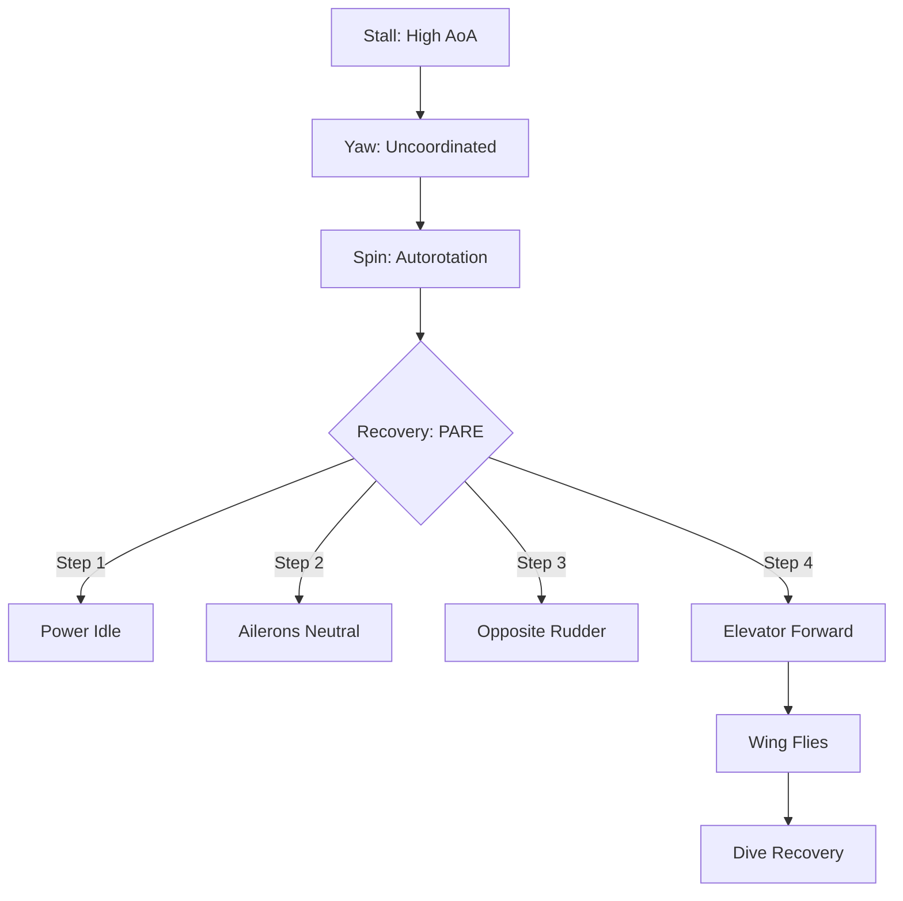

# Stalls, Spins, & Stability

## 1. Stability Defined
Stability is the aircraft's ability to correct for disturbances (turbulence, pilot input).

### Static vs. Dynamic
1.  **Static Stability:** The **Initial** Tendency.
    *   *Positive:* Wants to return to original state.
    *   *Neutral:* Stays in the new state.
    *   *Negative:* Moves further away (Divergent).
2.  **Dynamic Stability:** The response **Over Time**.
    *   *Positive:* Oscillations get smaller (Damped).
    *   *Neutral:* Oscillations stay the same size.
    *   *Negative:* Oscillations get worse (Divergent).

> [!NOTE]
> An aircraft *must* have Positive Static Stability to have Positive Dynamic Stability.

### The 3 Axes
| Stability | Axis | Control | Design Feature |
| :--- | :--- | :--- | :--- |
| **Longitudinal** | Lateral (Pitch) | Elevator | CG vs. Center of Lift (Tail downforce) |
| **Lateral** | Longitudinal (Roll) | Ailerons | Dihedral, Keel Effect |
| **Directional** | Vertical (Yaw) | Rudder | Weather Vane effect (Tail surface area) |

---

## 2. Stalls: The Critical Angle
**Definition:** A stall occurs when the wing exceeds its **Critical Angle of Attack (AoA)**.
*   **Key Fact:** A wing can stall at **any airspeed** and **any attitude** (e.g., high speed accelerated stall).
*   **Design:** Wings are twisted ("washout") so the **root stalls first**. This keeps the ailerons effective (at the tips) longer.

---

## 3. Spins: The Aggravated Stall
**Definition:** An uncoordinated stall. One wing is *more* stalled than the other.
*   **The Cause:** **Stall + Yaw.**
*   **The Trap:** If you try to lift the dropping wing with **Aileron**, you increase the AoA on that wing (down aileron = more camber/AoA). It stalls *deeper*, and the drag pulls the nose further into the spin.

### Recovery: PARE
*Memorize and visualize the 'Why'.*

1.  **P - Power IDLE:** Power tends to flatten the spin (gyroscopic) and airflow from the prop can blanket the tail, making the rudder less effective.
2.  **A - Ailerons NEUTRAL:** Stops the drag differential from driving the spin.
3.  **R - Rudder FULL OPPOSITE:** The primary force to stop the rotation.
4.  **E - Elevator FORWARD:** Breaks the stall. (You cannot fly until the wing is flying).

---

## 4. Center of Gravity (CG) Effects
*   **Forward CG:** More stable. Harder to stall (higher stall speed). Easy spin recovery (longer lever arm to tail).
*   **Aft CG:** Less stable. Lower stall speed. **Dangerous Spin Recovery** (The rudder has less leverage, and the tail-down force is weak).

---

## 5. Visualizing the Spin

---

## 6. Oral Exam / Checkride Scenarios

**Q1: "Can you stall while pointing straight down?"**
> **A:** Yes. If I pull back on the yoke abruptly, I can exceed the Critical Angle of Attack even in a vertical dive. (This is an accelerated stall).

**Q2: "Why is an Aft CG dangerous for spins?"**
> **A:** It shortens the "arm" between the CG and the rudder, reducing rudder authority. It also tends to flatten the spin, making it potentially unrecoverable.

**Q3: "What is a 'Cross-Controlled' stall?"**
> **A:** A stall occurring while the controls are crossed (e.g., Right Rudder, Left Aileron). This usually happens base-to-final when a pilot overshoots the centerline and tries to "cheat" the turn with rudder. It snaps into a spin over the top.

**Q4: "Explain 'Dihedral'."**
> **A:** The upward angle of the wings. If the plane sideslips (banks), the lower wing has a higher effective AoA than the upper wing, creating more lift and rolling the plane back to level. It provides **Lateral Stability**.

**Q5: "What is a 'Secondary Stall'?"**
> **A:** A stall that happens *during* the recovery from a first stall. Usually caused by pulling back too aggressively before the aircraft has regained sufficient flying speed.

---

## References
*   **PHAK Ch 5:** Aerodynamics.
*   **AC 61-67:** Stall and Spin Awareness Training.
