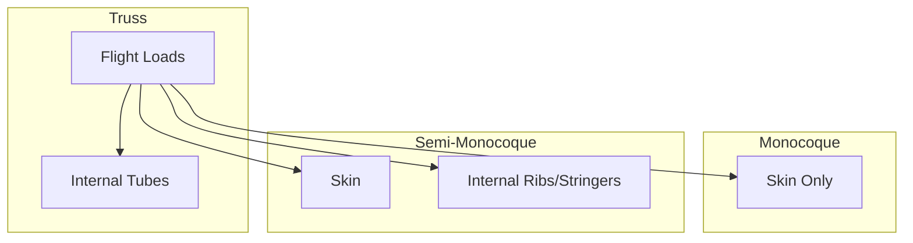

# Aircraft Structure Types

## Definition
The method used to bear the loads (stresses) imposed on the aircraft during flight and landing.

## The Three Main Types

### 1. Truss Structure
- **What it is:** A frame of tubes (wood or steel) covered in fabric. Like a bridge.
- **Load path:** The tubes take all the stress. The "skin" (fabric) just shapes the air.
- **Example:** Piper Cub, Citabria.

### 2. Monocoque (Eggshell)
- **What it is:** The skin carries *all* the load. No internal frame.
- **Pros:** Very strong for its weight.
- **Cons:** **Very intolerant to damage.** A small dent can cause total collapse (like a soda can).

### 3. Semi-Monocoque (Standard)
- **What it is:** A hybrid. Uses an internal substructure (bulkheads, stringers, formers) covered by a skin that shares the load.
- **Pros:** Strong, redundant. If the skin is dented, the internal ribs still hold.
- **Example:** Cessna 172, Piper Archer (and almost all modern metal planes).

## Checkride Angle
- **Question:** "Why do we look for wrinkled skin (oil canning) or loose rivets on preflight?"
- **Answer:** It indicates the semi-monocoque structure has been overstressed (hard landing or turbulence) and the skin is shearing away from the frame.

## Diagram: Load Bearing

## Study Drills
1. Which structure type relies entirely on the skin for strength? (Monocoque).
2. Most modern metal training aircraft use which design? (Semi-Monocoque).

## References
- PHAK Chapter 3
