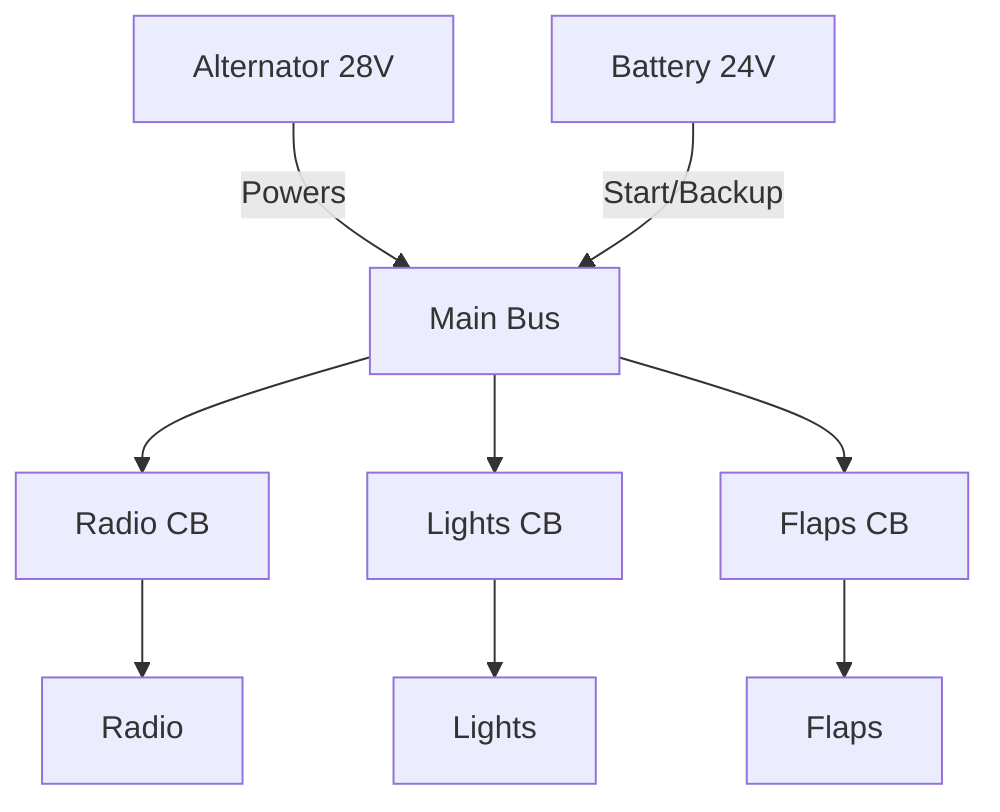

# Electrical System Fundamentals

## Definition
The system that powers the avionics, lights, flaps, and starting motor.

## Key Components
1.  **Battery:** (Usually 12V or 24V). Used for **starting** and as a backup.
2.  **Alternator:** (Usually 14V or 28V). Belt-driven. Powers the system **in flight** and recharges the battery.
3.  **Bus Bar:** A metal strip that distributes power to circuit breakers.
4.  **Circuit Breakers:** Fuses that pop out to protect equipment from over-voltage/heat.

## Voltage Logic
- The Alternator produces slightly **higher** voltage (14V/28V) than the Battery (12V/24V) to push charge back into the battery.
- If the Ammeter shows a **discharge**, the Alternator has failed, and you are running on battery (time is limited!).

## Checkride Angle
- **Scenario:** "The Low Volts light comes on and the ammeter shows a discharge. What do you do?"
- **Answer:**
    1.  Cycle the Alternator side of the Master switch (reset).
    2.  If no joy, turn off non-essential equipment (Land light, extra radios).
    3.  Land as soon as practical. (You have maybe 30 mins of battery).

## Diagram: Flow

## Study Drills
1. Can you reset a popped circuit breaker in flight? (Only once, and only if essential. Never reset it twice—fire risk).
2. Does the alternator work without the engine running? (No).

## References
- PHAK Chapter 7