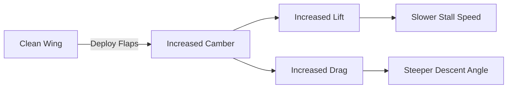

# Flaps: Types & Usage

## Definition
Movable panels on the trailing edge of the wing used to increase lift and drag.

## Why We Use Them
1.  **Lower Stall Speed:** Allows slower landing approaches.
2.  **Steeper Approach Angle:** High drag allows us to descend without gaining speed (getting over obstacles).

## The Four Common Types

| Type | Description | Pros/Cons |
| :--- | :--- | :--- |
| **Plain** | Hinge at the back. | Simple, but high drag. |
| **Split** | Lower skin drops, upper skin stays. | High drag, less lift. (WW2 fighters). |
| **Slotted** | Gap opens between wing and flap. | High energy air from below re-energizes airflow over flap. Delays separation. |
| **Fowler** | Slides **back** on tracks. | **Increases Wing Area.** Best lift increase. (Most airliners/Cessnas). |

## Checkride Angle
- **Question:** "What function do flaps serve on landing?"
- **Answer:** They allow a steeper approach path without increasing airspeed.
- **Scenario:** "You accidentally retract flaps from 40° to 0° at 50 feet. What happens?"
- **Answer:** Massive loss of lift. The plane drops (sinks) rapidly onto the runway.

## Diagram: Flap Effect

## Study Drills
1. Which flap type actually increases the surface area of the wing? (Fowler).
2. Why is the first notch of flaps (e.g., 10°) often used for takeoff? (It provides more lift than drag).

## References
- PHAK Chapter 6
