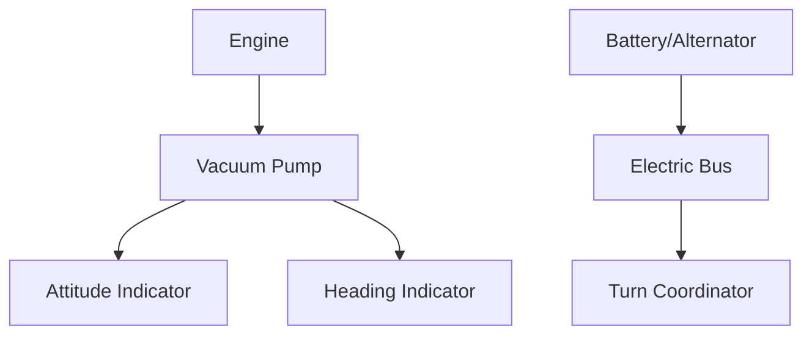

# Gyroscopic Instruments

## Definition
Instruments that use a spinning wheel (gyro) to maintain a fixed position in space.
**Principles:**
1.  **Rigidity in Space:** The gyro stays put, the plane moves around it.
2.  **Precession:** Force applied is felt 90° later.

## Power Sources
- **Vacuum (Suction):** Powers Attitude Indicator (AI) and Heading Indicator (HI).
- **Electric:** Powers Turn Coordinator (TC).
- **Why split them?** Redundancy. If the vacuum pump fails, you still have the Turn Coordinator to keep wings level.

## The Instruments
1.  **Attitude Indicator (AI):** Rigidity. Shows Pitch and Bank.
2.  **Heading Indicator (HI):** Rigidity. Shows Direction. (Drifts over time due to friction/earth rotation; must reset to compass every 15 mins).
3.  **Turn Coordinator:** Precession. Shows rate of turn and coordination (Ball).

## Checkride Angle
- **Scenario:** "The vacuum gauge reads zero. What do you lose?"
- **Answer:** Attitude Indicator and Heading Indicator.
- **Action:** Cover them up (Sticky note) so you don't get vertigo. Fly with the Turn Coordinator.

## Diagram: Power Source

## Study Drills
1. Which gyro instrument is usually electric? (Turn Coordinator).
2. Why do you have to align the Heading Indicator? (It has no magnetic sense; it just holds rigidity, but drifts).

## References
- PHAK Chapter 8
