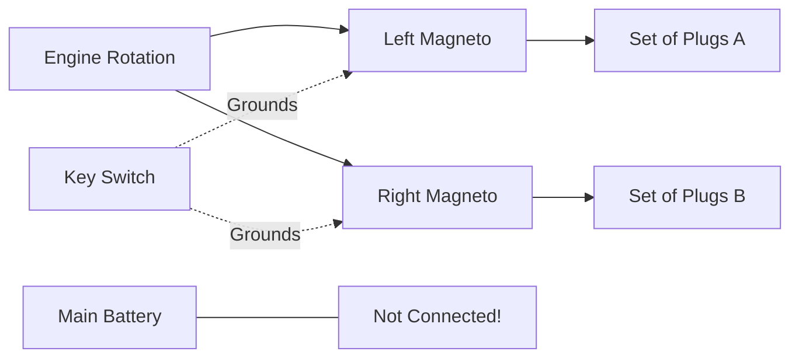

# Ignition & Magnetos

## Definition
A self-contained electrical generator driven by the engine that provides the spark for the spark plugs.

## Key Concept: Redundancy
- Aircraft engines have **Two Magnetos** (Left and Right).
- Each cylinder has **Two Spark Plugs**.
- One magneto fires the top plugs on some cylinders and bottom on others.
- **Why?**
    1.  **Safety:** If one mag fails, the engine still runs (roughly).
    2.  **Efficiency:** Two sparks ignite the fuel faster, giving more power.

## Independence
**Magnetos are NOT connected to the aircraft battery.**
- If the electrical system fails (Master Switch OFF), the engine **keeps running**.
- To stop the engine, you must ground the magneto (Turn key to OFF).

## The Ground Wire (P-Lead)
- The ignition switch works by **grounding** the magneto (connecting it to the airframe) to stop it firing.
- If the P-Lead breaks, the magneto is "Hot" (Live). Moving the prop could start the engine!

## Checkride Angle
- **Question:** "Why do we check the mags at runup?"
- **Answer:** To verify both are working and that the ground wire can turn them off. A drop of >150 RPM (typically) indicates a fouled plug or bad mag. No drop means the P-Lead is broken (Dangerous!).

## Diagram: Mag Logic

## Study Drills
1. If you turn the master switch off in flight, does the engine quit? (No).
2. What does a "dead cut" check confirm? (That the P-Leads are working and can shut off the mags).

## References
- PHAK Chapter 7
