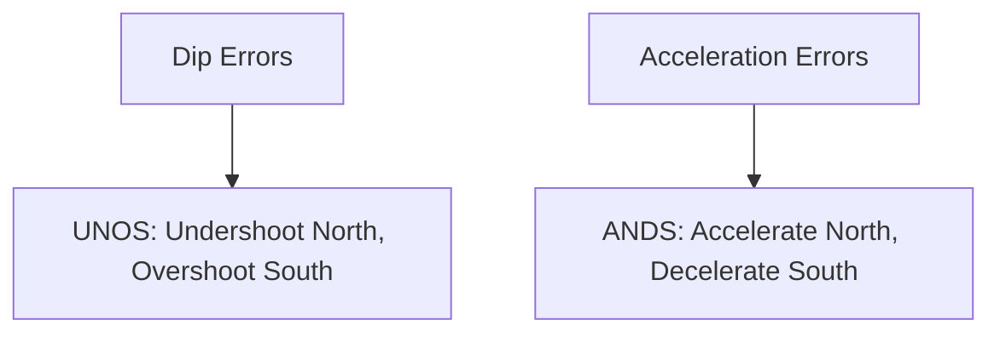

# Magnetic Compass Errors

## Definition
The magnetic compass is reliable but subject to specific errors due to the dip of the Earth's magnetic field.

## The Errors

### 1. Variation
- Difference between **True North** (Maps) and **Magnetic North** (Compass).
- Corrected by: Isogonic lines on the chart. "East is Least (Subtract), West is Best (Add)."

### 2. Deviation
- Magnetic interference from the airplane's electronics.
- Corrected by: Compass Correction Card (in the plane).

### 3. Dip Errors (Turning) - "UNOS"
- **U**ndershoot **N**orth: When turning North, the compass lags (shows a turn in opposite direction initially). Stop the turn *before* North.
- **O**vershoot **S**outh: When turning South, the compass leads (runs ahead). Stop the turn *after* South.

### 4. Acceleration Errors - "ANDS"
- **A**ccelerate **N**orth: On East/West headings, accelerating makes it show a turn to the North.
- **D**ecelerate **S**outh: Decelerating makes it show a turn to the South.

## Checkride Angle
- **Scenario:** "You are flying East and push the throttle full forward. The compass swings. Which way?"
- **Answer:** It swings North (Accelerate North).

## Diagram: Memory Aid

## Study Drills
1. What heading does ANDS apply to? (East and West headings. It doesn't happen on N/S).
2. If turning from South to West, should you roll out early or late? (Late, because it overshoots South).

## References
- PHAK Chapter 8
