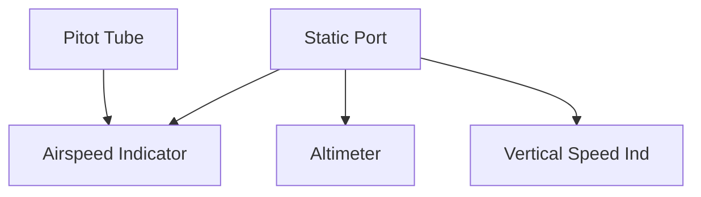

# Pitot-Static System

## Definition
Instruments that rely on air pressure differentials.
1.  **Pitot Tube:** Measures **Ram Air Pressure** (Impact).
2.  **Static Port:** Measures **Static Pressure** (Ambient).

## The Instruments

| Instrument | Uses Pitot? | Uses Static? | Function |
| :--- | :--- | :--- | :--- |
| **Airspeed (ASI)** | **YES** | **YES** | Compares Ram vs. Static to determine speed. |
| **Altimeter** | NO | **YES** | Expands as static pressure drops (Climb). |
| **VSI** | NO | **YES** | Measures *rate of change* in static pressure. |

## Failures (Memorize This!)

1.  **Blocked Pitot (Drain Open):** ASI drops to zero.
2.  **Blocked Pitot (Drain Blocked):** ASI acts like an Altimeter (goes up in climb).
3.  **Blocked Static Port:**
    - ASI: Errors (reads low in climb).
    - Altimeter: Freezes at blocked altitude.
    - VSI: Freezes at zero.

## Checkride Angle
- **Scenario:** "We are climbing. The Altimeter is moving, but the Airspeed Indicator is increasing rapidly like an altimeter. What is wrong?"
- **Answer:** Blocked Pitot tube (Ram + Drain) with an open Static port.

## Diagram: Connections

## Study Drills
1. Which instrument is the only one to use the Pitot tube? (ASI).
2. If the static port freezes over, what can you do? (Use Alternate Static Source or break the VSI glass).

## References
- PHAK Chapter 8