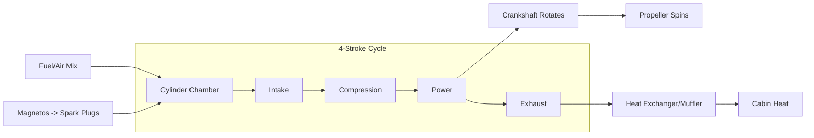

# Reciprocating Powerplant Basics

## 1. What is it?
Your training aircraft likely uses a 4-stroke piston engine. A common acronym to describe it (e.g., for a Cessna 172) is **LHAND**:
*   **L**ycoming (Manufacturer)
*   **H**orizontally **O**pposed (Cylinders face each other flat; reduces vibration).
*   **A**ir Cooled (Uses airflow over fins, not a radiator).
*   **N**aturally Aspirated (No turbocharger; relies on atmospheric pressure).
*   **D**irect Drive (Propeller bolts directly to the crankshaft; RPM is 1:1).

---

## 2. The 4-Stroke Cycle (The Otto Cycle)
*Standard mnemonic: Suck, Squeeze, Bang, Blow.*

1.  **Intake:** Intake valve opens, piston moves down, sucking fuel/air mixture into the cylinder.
2.  **Compression:** Valves close, piston moves up, squeezing the mixture (creating potential energy).
3.  **Power:** Spark plugs fire, controlled explosion forces piston down (turning the crankshaft).
4.  **Exhaust:** Exhaust valve opens, piston moves up, pushing burned gases out to the muffler.

---

## 3. Critical Safety: Abnormal Combustion
*This is a killer item on checkrides. Know the difference.*

### Detonation
*   **What is it?** An explosive, uncontrolled, instantaneous ignition of the fuel/air mixture (instead of a smooth burn).
*   **Causes:** Lower grade fuel, high power with lean mixture, climbing too steeply (overheating).
*   **Symptoms:** Engine knocking/pinging (often inaudible), high Cylinder Head Temp (CHT), loss of power.
*   **Pilot Action:** Reduce power, enrich mixture, lower nose (increase cooling airflow).

### Pre-Ignition
*   **What is it?** The mixture ignites *before* the spark plug fires, usually due to a hot spot (carbon deposit or cracked plug).
*   **Result:** The piston is still moving up while the explosion tries to push it down. Can destroy an engine in seconds.
*   **Pilot Action:** Immediate reduction of power and landing.

---

## 4. Systems Diagnostics (Troubleshooting)

| Symptom | Likely Cause | Pilot Action |
| :--- | :--- | :--- |
| **Rough Running** | Fouled spark plug or Magneto issue | Check Magnetos (L/R). If smooth on one, run on that one (emergency) or lean mixture to burn off deposits (if fouled). |
| **High Oil Temp** | Low oil level or poor airflow | Level off (cruise climb), enrich mixture, open cowl flaps (if equipped). |
| **Loss of RPM (Fixed Pitch)** | Carb Ice or Throttle Creep | Apply Carb Heat (expect initial drop, then rise). Tighten friction lock. |
| **Low Oil Pressure** | Oil pump failure or leak | Land as soon as possible. If temp rises too, **Land Immediately** (engine failure imminent). |

---

## 5. Visualizing the System

> [!WARNING] **Cabin Heat & Carbon Monoxide**
> Because cabin heat is often taken from a shroud around the exhaust muffler, a crack in the muffler can leak Carbon Monoxide (CO) into the cabin.
> *   **Symptoms:** Headache, drowsiness, fuzzy vision.
> *   **Action:** Shut off heat, open vents/windows, land immediately.

---

## 6. Oral Exam / Checkride Scenarios

**Q1: "During your run-up, you switch to the LEFT magneto and the engine quits completely. What does this tell you?"**
> **A:** The Left magneto is working fine (it grounded the Right one), but the *Right* magneto (which you just turned off) was the only thing keeping the engine running. Wait... if I switch to Left and it dies, it means the LEFT magneto is dead or the grounding wire is broken in a way that kills it.
> *Correction:* Actually, if you switch to LEFT, you are grounding the RIGHT. If the engine dies, the LEFT magneto is not firing. The Right magneto was doing all the work.

**Q2: "Why do we check the oil pressure right after starting?"**
> **A:** To ensure the oil pump is working. Without oil pressure, metal-on-metal friction will seize the engine in minutes. If no pressure within 30 seconds (60 in winter), shut down.

**Q3: "You are climbing out and notice your Cylinder Head Temperature (CHT) is near the red line. What do you do?"**
> **A:** The engine is overheating. I will:
> 1. Lower the nose (increase airspeed for cooling).
> 2. Enrich the mixture (fuel cools the cylinders).
> 3. Reduce power if possible.

**Q4: "Explain why a loose magneto grounding wire is dangerous."**
> **A:** If the P-lead (ground wire) breaks, the magneto is "Hot" (live) even if the key is switched to OFF. If someone moves the propeller by hand on the ground, the engine could kick over and start, causing severe injury.

**Q5: "What is the difference between a turbocharger and a supercharger?"**
> **A:** Both compress induction air. A **Turbocharger** is driven by exhaust gases (free energy but laggy). A **Supercharger** is mechanically driven by the engine (instant response but steals some engine power). (Most trainers are naturally aspirated).

---

## References
*   **PHAK Ch 7:** Aircraft Systems.
*   **POH Section 7:** Airplane & Systems Description.