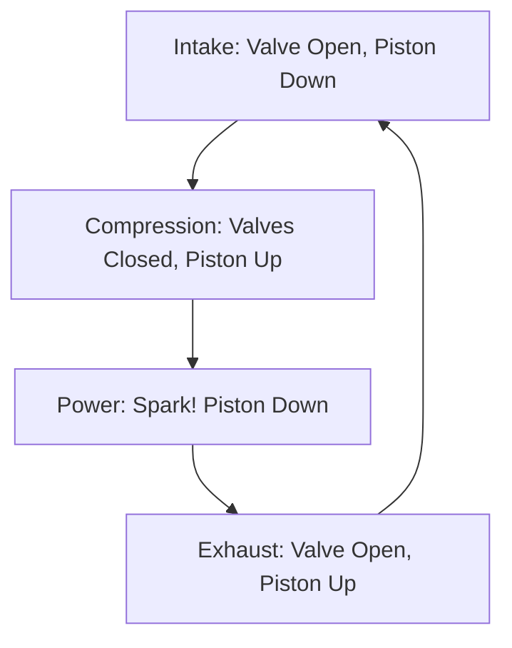

# Reciprocating Powerplant Basics

## Definition
Most trainers use a horizontally opposed, air-cooled, naturally aspirated, direct-drive piston engine. (e.g., Lycoming IO-360).

## The 4-Stroke Cycle (Otto Cycle)
Memorize this: **Suck, Squeeze, Bang, Blow.**

1.  **Intake (Suck):** Piston moves down, intake valve opens, fuel/air mixture enters.
2.  **Compression (Squeeze):** Piston moves up, valves closed, mixture compressed.
3.  **Power (Bang):** Spark plugs fire, mixture explodes, pushing piston down. (This turns the prop).
4.  **Exhaust (Blow):** Piston moves up, exhaust valve opens, burned gas pushed out.

## Cooling
- **Air Cooled:** Fins on the cylinders transfer heat to airflow.
- **Shock Cooling:** Descending too fast with low power can crack cylinders. Plan descents carefully.

## Checkride Angle
- **Question:** "What does 'Horizontally Opposed' mean?"
- **Answer:** The cylinders are flat, opposing each other (like a Boxer engine), which cancels vibration and fits well in a flat cowling.

## Diagram: The Cycle

## Study Drills
1. Which stroke provides the power to turn the propeller? (Power stroke).
2. Why do we have dual spark plugs? (Redundancy and more efficient burning).

## References
- PHAK Chapter 7