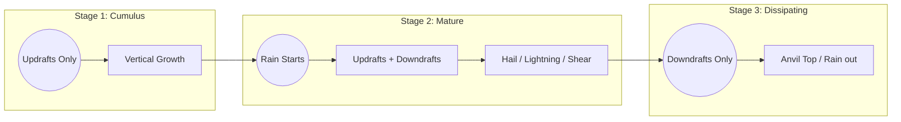

# Clouds, Fronts, & Weather Hazards

## 1. Frontal Systems (The "Weather Makers")
A front is the boundary layer between two types of air masses. **If you cross a front, the wind direction AND temperature will change.**

| Feature | **Cold Front** | **Warm Front** |
| :--- | :--- | :--- |
| **Speed** | Moves fast (25-30 kts). Acts like a snowplow. | Moves slow (10-25 kts). Slides over cool air. |
| **Clouds** | Towering Cumulus, Cumulonimbus (Vertical). | Stratus, Nimbostratus, Cirrus (Horizontal/Layered). |
| **Precipitation** | Heavy rain, lightning, hail (Showery). | Light to moderate rain, drizzle, fog (Steady). |
| **Visibility** | Poor during passing, **Good** after passage. | Poor before (fog/haze), Fair after. |
| **Turbulence** | Rough, choppy. | Smooth (unless embedded thunderstorms exist). |

> [!NOTE] **Stationary Front**
> Two air masses meet but neither pushes the other. Result: **Days of cloudy, wet, IFR weather.**

> [!NOTE] **Occluded Front**
> A fast cold front catches a slow warm front. Result: **A nasty mix of both (embedded thunderstorms, widespread rain).**

---

## 2. Thunderstorms (The VFR Killer)
*Never flirt with a thunderstorm. The AIM recommends staying **20 NM away**.*

### The 3 Stages
1.  **Cumulus Stage:** Strong **Updrafts** only. The cloud grows vertically.
2.  **Mature Stage:** **Precipitation begins** at the surface. Rain creates downdrafts alongside updrafts. *Most dangerous stage (Hail, Lightning, Microbursts).*
3.  **Dissipating Stage:** **Downdrafts** dominate. The cloud rains itself out and turns into an anvil shape.

### Hazards
*   **Microbursts:** Intense downdrafts (up to 6,000 fpm) that spread out on the ground. Headwind -> Downdraft -> Tailwind.
*   **Hail:** Can occur miles away from the cloud core (under the anvil).
*   **Turbulence:** Can rip wings off.

---

## 3. Fog Types (The 5 Types)
*Fog is just a cloud touching the ground.*

1.  **Radiation Fog:** Calm, clear nights. Ground cools, cooling the air above it to dewpoint. (Burns off with sun).
2.  **Advection Fog:** Moist warm air moves over a cold surface (e.g., sea fog in San Francisco). Requires wind.
3.  **Upslope Fog:** Moist stable air pushed up a mountain. Cooling by expansion (adiabatic).
4.  **Steam Fog:** Cold dry air moves over warm water. (Looks like smoke/steam). Unstable/turbulence possible.
5.  **Precipitation-Induced (Frontal) Fog:** Warm rain falls through cool air, saturating it.

---

## 4. Structural Icing
*Requirement: **Visible Moisture** + **Temperature 0°C or colder**.*

*   **Clear Ice:** Large drops freeze slowly, spreading over the wing. Heavy and hard to remove. (Warmer temps, 0° to -10°).
*   **Rime Ice:** Small drops freeze instantly. Rough, milky appearance. Changes wing shape. (Colder temps, -15° to -20°).
*   **Mixed Ice:** A combination of both.

> **Pilot Action:** If you encounter icing, **Leave the area immediately.**
> *   Climb (if temperature inversion).
> *   Descend (to warmer air).
> *   Turn back (180°).

---

## 5. Visualizing the Thunderstorm Lifecycle

---

## 6. Oral Exam / Checkride Scenarios

**Q1: "You see a lenticular cloud over a mountain ridge. What does that tell you?"**
> **A:** It indicates a **Mountain Wave** with severe to extreme turbulence. The air is flowing smoothly *through* the cloud, but the rotor zones below/near it are dangerous. I will stay well clear (upwind or very high above).

**Q2: "What is the most dangerous stage of a thunderstorm and why?"**
> **A:** The **Mature Stage**, signaled by the start of precipitation. It has both updrafts and downdrafts, causing severe wind shear, microbursts, and hail.

**Q3: "Departing early morning, you see fog. The wind is calm. What type is it likely to be, and will it clear?"**
> **A:** Likely **Radiation Fog**. It forms on clear, calm nights. It will likely burn off as the sun warms the ground. If the wind picks up significantly, it might dissipate or turn into low stratus.

**Q4: "Can you fly through a Cold Front?"**
> **A:** Legally? Maybe. Wisely? Probably not in a light trainer. Cold fronts bring squall lines, thunderstorms, and rapid weather changes. I would wait for it to pass (weather usually improves quickly behind it).

**Q5: "What conditions are necessary for a thunderstorm to form?"**
> **A:** Three things:
> 1.  **Moisture** (High humidity).
> 2.  **Unstable Air** (High lapse rate).
> 3.  **Lifting Action** (Fronts, heating, terrain).

---

## References
*   **PHAK Ch 12:** Weather Theory.
*   **AC 00-6B:** Aviation Weather.
