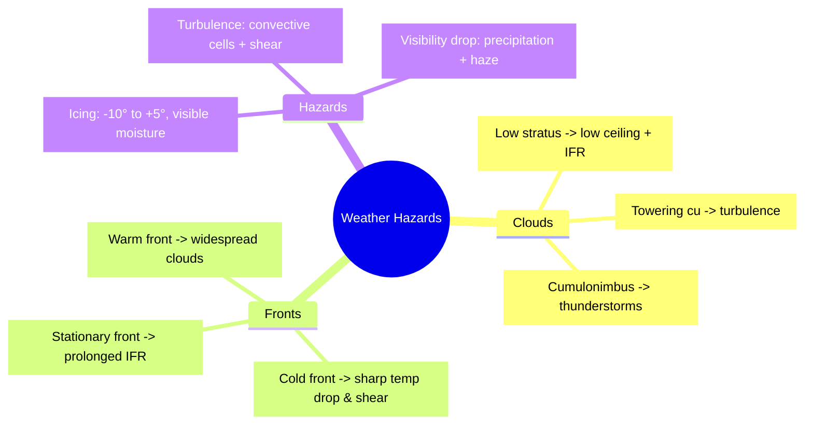

# Clouds, Fronts, & Weather Hazards

## What it is
This is the study of cloud types, frontal boundaries, and the hazards they bring—icing, turbulence, thunderstorms, and low visibility—that directly affect VFR decision-making.

## Why it matters
DPEs check that you can tie a cloud or front to a hazard and articulate how that changes your plan (e.g., avoid cumulonimbus or stay out of icing conditions).

## How it shows up on a checkride
- **Q:** “How do you know when icing is likely?” **A:** Visible moisture, temps 0°C to -10°C, and the presence of visible moisture (clouds or precipitation).
- **Q:** “What front would you avoid as a VFR pilot?” **A:** Fast-moving cold fronts with severe turbulence and low ceilings.
- **Q:** “Which cloud indicates strong vertical currents?” **A:** Cumulonimbus—they are thunderstorm clouds with heavy precipitation and possible hail/lightning.

## Common mistakes
- Calling stratocumulus “harmless” in IMC; they can reduce ceilings below legal minimums.
- Assuming all turbulence is light; near thunderstorms it can be extreme with wind shear.
- Overlooking the difference between convective vs stable moisture; convective signals strong updrafts.

## Diagram

## ACS Tags
- Area of Operation: Weather (W.II)
- Task(s): W.II.A Identify weather hazards from cloud & front cues.
- Knowledge elements: Cloud type recognition, front signatures, icing/turbulence triggers.

## References
- PHAK Ch 12 Weather theory (clouds, fronts, icing, visibility).
- PHAK Ch 13 Weather services (hazardous weather briefings, AIRMETs/SIGMETs).
