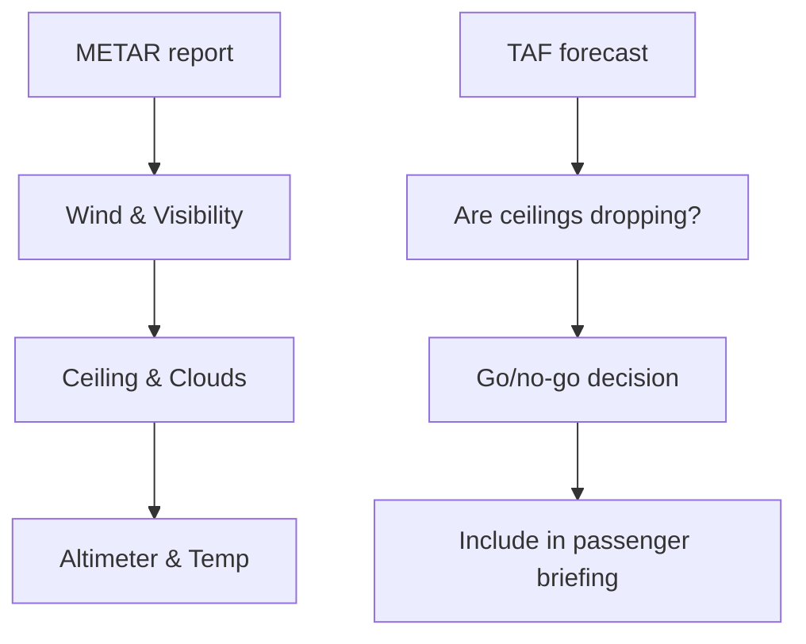

# METAR & TAF Interpretation

## What it is
METARs and TAFs are routine weather reports and forecasts, respectively, that combine coded groups (e.g., OVC020, 18015KT) into a snapshot of current conditions and expected changes.

## Why it matters
A checkride oral expects you to decode real METARs in seconds and explain the operational decisions—e.g., whether a crosswind component or low ceilings keep you on the ground.

## How it shows up on a checkride
- **Q:** “What does `KLGB 041253Z 19008KT 10SM SCT025 21/14 A2992` tell you?” **A:** Wind 190°/8Kts, visibility 10SM, scattered clouds at 2,500 ft, temp 21°C/dew 14°C, altimeter 29.92.
- **Q:** “How do you use a TAF before a local flight?” **A:** Identify prevailing wind shifts, ceiling trends, and any tempo groups indicating MVFR/IFR entry.
- **Q:** “Why do you care about the difference between FM and TEMPO groups?” **A:** FM signals a sustained change while TEMPO indicates intermittent variations that might not affect the entire flight.

## Common mistakes
- Reading the TAF as if it applies to the entire day; treat it as a forecast window with active groups keyed by time.
- Ignoring the remarks (RMK) section that warns of thunderstorm probability or runway contamination.
- Failing to convert cloud bases to AGL/AGL difference—they directly impact VFR minimums.

## Diagram

## ACS Tags
- Area of Operation: Weather (W.I)
- Task(s): W.I.A Decode METAR/TAF data for preflight planning.
- Knowledge elements: METAR structure, TAF groups (FM/TEMPO), operational impacts of ceilings/visibility.

## References
- PHAK Ch 13 Aviation weather services (METAR/TAF decoding, interpreting tempo/fm remarks).
