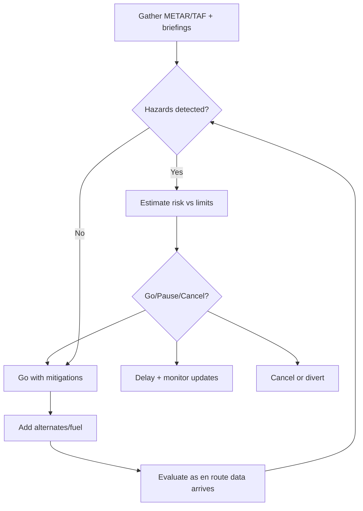
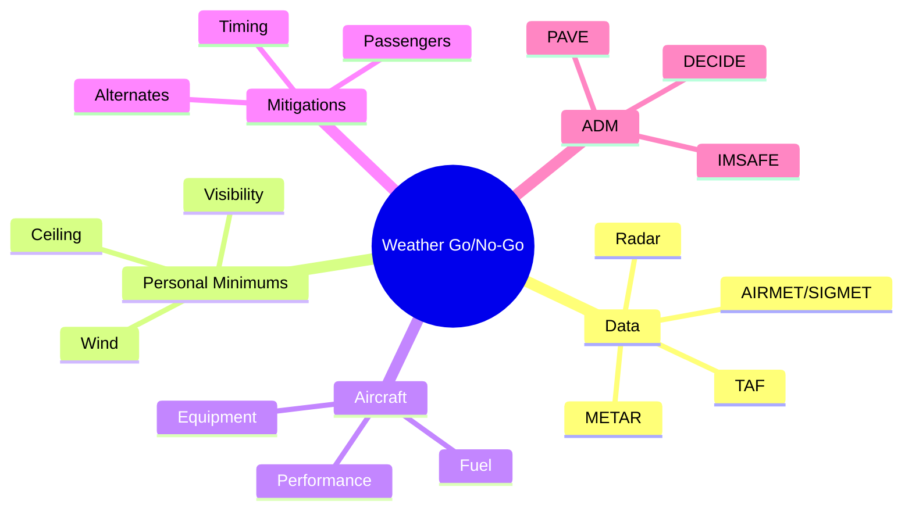

# Weather Go/No-Go Decision Tree

## What it is
This note turns the DECIDE model into a concrete weather-focused decision tree: detect hazards from METAR/TAF, define your limits, and choose the safest outcome before you ever taxi.

## Why it matters
DPEs expect a clear weather decision path—knowing the raw data isn’t enough. You must show how you filter hazards, apply personal minimums, and enforce conservative go/no-go choices that protect the flight.

## Step-by-step reasoning
1. **Detect** the most recent weather (METAR, TAF, AIRMET/SIGMET, radar) and note trends.  
2. **Estimate** how the weather toys with your personal minimums, equipment, and passengers.  
3. **Choose** a plan: go, delay, alternates, or cancel.  
4. **Identify** mitigations: reroutes, higher fuel, extra alternates, or an instrument rating.  
5. **Do**—file the plan, brief passengers, and execute with discipline.  
6. **Evaluate** en route: if any new data erodes the safety buffer, restart the loop.

### Diagram 1 – Decision flowchart


### Diagram 2 – Mindmap of subtopics


### Diagram 3 – ASCII sketch of frontal impact
```
      ___ Warm Front ___
     /                /
----/------------/---/  Surface
   / Stratiform /   /Clouds
  /___________/   /
  Cold air pools  /
   ↓             ↓
   ↓     ↑ Moisture
  ──────────────
```

## Misconceptions
- “If the METAR is VFR now, the rest of the flight will stay VFR.” – No, forecasts change; always carry a go/no-go update before taxi.
- “I can fly if the ceiling is just above my floor.” – That leaves no safety buffer; add 500–1,000 feet for unpredicted degradation.
- “As long as the weather passes the legal minimums, I’m fine.” – Legal minimums are the floor; use your personal minimums to stay safe.
- “Clouds reported in the TAF are instantly binding.” – They represent trends; evaluate the timing (FM/TEMPO) and apply a decision window.
- “If a SIGMET isn’t shown in the briefing, it cannot impact me.” – SIGMETs can be updated; keep checking en route and reroute even if the old briefing was clean.

## Oral Exam Drill
1. **Q:** What is the first step in the weather decision tree?  
   **A:** Gather current METAR/TAF plus any AIRMETs/SIGMETs to detect hazards.  
2. **Q:** How do personal minimums plug into the DECIDE loop?  
   **A:** Compare the detected hazards to your checklist (ceiling, visibility, wind) before estimating risk.  
3. **Q:** When do you choose to delay instead of cancel?  
   **A:** When the hazard window is short (TEMPO/PROB) and your passengers can wait for improvement.  
4. **Q:** Why add alternates during the “Identify” step?  
   **A:** Alternates become risk controls when the primary destination’s weather deteriorates unexpectedly.  
5. **Q:** How does fuel planning support this tree?  
   **A:** Extra fuel gives you time to evaluate new data before committing to a landing.  
6. **Q:** What triggers a restart of the tree after takeoff?  
   **A:** New METAR/TAF or SIGMET updates that erode the original safety margins en route.  
7. **Q:** What role does IMSAFE play?  
   **A:** It keeps the pilot’s condition from becoming the weak link in the decision process.  
8. **Q:** How do you brief passengers using this tree?  
   **A:** Mention the weather checks, your go/no-go criteria, and the plan if conditions worsen.  
9. **Q:** What’s the difference between a TEMPO group and a FM group in TAF?  
   **A:** TEMPO is intermittent, FM is sustained; treat FM as a plan change candidate.  
10. **Q:** When do you file a flight plan in relation to this tree?  
    **A:** After choosing “Go” but before engine start, so ATC knows your intended route/reserve.  
11. **Q:** How do you handle contradictory weather sources?  
    **A:** Prioritize official (METAR/TAF) data, confirm with flight service, and err on the conservative side.  
12. **Q:** How do you use radar in the decision tree?  
    **A:** Detect convective cells early; if they threaten your route you delay/divert.  
13. **Q:** When is the “Cancel” branch the only safe option?  
    **A:** When the hazards exceed your personal/pilot currency minimums and no reasonable mitigation exists.  
14. **Q:** How do you decide which alternates to include?  
    **A:** Choose airports with better weather trends, services, and fuel that keep you away from the hazard.  
15. **Q:** Why does this tree keep looping back to detection?  
    **A:** Weather is dynamic; you must reassess continuously until touchdown or cancellation.

## Related concepts
- [[04-Weather/Notes/METAR-TAF-Interpretation|METAR & TAF Interpretation]]
- [[04-Weather/Notes/Clouds-Fronts-Hazards|Clouds, Fronts, & Weather Hazards]]
- [[06-Human-Factors/Notes/IMSAFE-Decision-Loop|IMSAFE & Decision Loop]]
- [[06-Human-Factors/Notes/Hypoxia-Disorientation|Hypoxia & Spatial Disorientation]]
- [[05-Navigation/Notes/Flight-Planning-Workflow|VFR Flight Planning Workflow]]
- [[07-Performance-WeightBalance/Notes/Density-Altitude-Impact|Density Altitude Impact]]

## References
- PHAK Ch 2 Aeronautical decision-making (DECIDE, PAVE, IMSAFE).
- PHAK Ch 12 Weather theory (hazards, fronts, clouds).
- PHAK Ch 13 Weather services (METAR/TAF decomposition, SIGMETs, AIRMETs).
