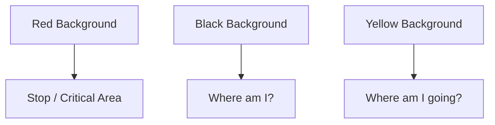

# Airport Signs & Markings

## The Colors (Memorize This)
1.  **Red Background, White Text:** **MANDATORY**. (Stop, Hold Short, No Entry).
    - Example: `4-22` in white on red. "Hold Short of Runway 4-22."
2.  **Black Background, Yellow Text:** **LOCATION**. "Black Square, You're There."
    - Example: `A` in yellow on black. "You are on Taxiway Alpha."
3.  **Yellow Background, Black Text:** **DIRECTION**. "Yellow Array points the Way."
    - Example: `B ->`. "Taxiway Bravo is to the right."

## The Markings
- **Hold Short Line:** Two solid yellow lines, two dashed yellow lines.
    - **Solid Side:** Must STOP. (Unless cleared).
    - **Dashed Side:** Can cross (Exiting runway).
- **Displaced Threshold:** White arrows leading to a white bar.
    - **Can you taxi/takeoff?** Yes.
    - **Can you land?** NO. (Landing zone starts after the bar).

## Checkride Angle
- **Scenario:** "You see a sign with a white '4' on a red background. What do you do?"
- **Answer:** Stop. Verify clearance. It's a runway holding position.
- **Scenario:** "The tower clears you to taxi to 22. Can you cross runway 14 on the way?"
- **Answer:** NO. A clearance to taxi to a runway **does not** authorize crossing intersecting runways (explicit clearance required).

## Diagram: Sign Logic

## Study Drills
1. What does a chevron (yellow arrows) area before a runway mean? (Blast pad. Do not taxi, takeoff, or land. It's not load bearing).
2. What color are taxiway edge lights? (Blue).

## References
- PHAK Chapter 13
