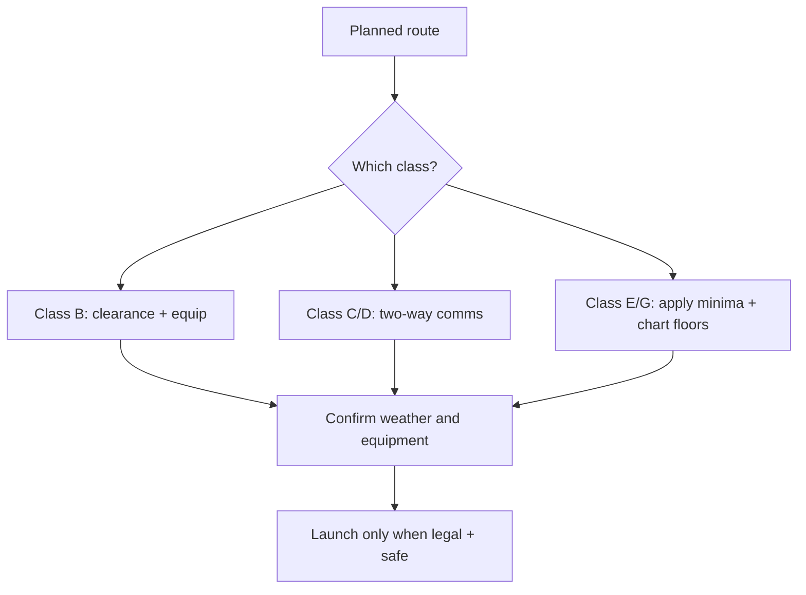

# Airspace Classes Quick Map

## What it is
A fast mental model for Class A/B/C/D/E/G and common entry/equipment/weather requirements relevant to private pilot operations.

## Why it matters
Airspace errors are common oral and practical-test failures. You must rapidly identify entry requirements from a sectional.

## Checkride angle
- Class B: explicit ATC clearance required.
- Class C/D: establish two-way radio communication before entry.
- Class E/G: understand floors/ceilings and VFR minima by altitude/day-night.

## Quick memory model
- B: busiest shelf, clearances strict.
- C: two-layer radar/service area.
- D: towered local control area.
- E: controlled airspace that is not A/B/C/D.
- G: uncontrolled surface/low-level areas.

## Diagram

## References
- FAA-H-8083-25C PHAK, Chapter 14.
- AIM Chapter 3 (Airspace).
- FAR 91.155 (VFR weather minimums).
