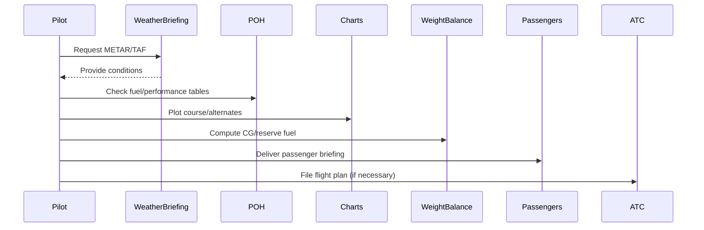

# VFR Flight Planning Workflow

## What it is
The workflow combines weather briefing, performance prep, fuel planning, weight & balance, navigation logs, and alternates into a cohesive go/no-go package.

## Why it matters
Checkride evaluators expect a documented plan, including diversions and fuel burn, not just a vague “we’ll see” attitude.

## How it shows up on a checkride
- **Q:** “What fuel reserve do you plan for?” **A:** Day VFR reserve is 30 minutes of fuel at normal cruise consumption; night is 45 minutes.
- **Q:** “How do you pick an alternate?” **A:** A nearby airport with suitable weather, services, and runway oriented for prevailing winds, factoring in any special-notam or airspace issues.
- **Q:** “What are the key steps you perform before departure?” **A:** Weather brief, fuel check, weight & balance, NOTAMs, navigation log, and passenger brief.

## Common mistakes
- Failing to verify airport/runway status via NOTAMs; they can close runways or change frequencies.
- Using the same fuel reserve for every flight without adjusting for headwinds or waiting in traffic.
- Not carrying a copy of the nav log or forgetting to brief passengers on emergency frequencies.

## Diagram

## ACS Tags
- Area of Operation: Navigation (N.III)
- Task(s): N.III.A Use performance and weather data to build a go/no-go plan.
- Knowledge elements: Fuel planning, alternates, NOTAM/PHAK references, passenger briefs.

## References
- PHAK Ch 16 Navigation (flight planning, pilotage, dead reckoning).
- PHAK Ch 10 Weight and Balance (loading calculations, CG limits).
