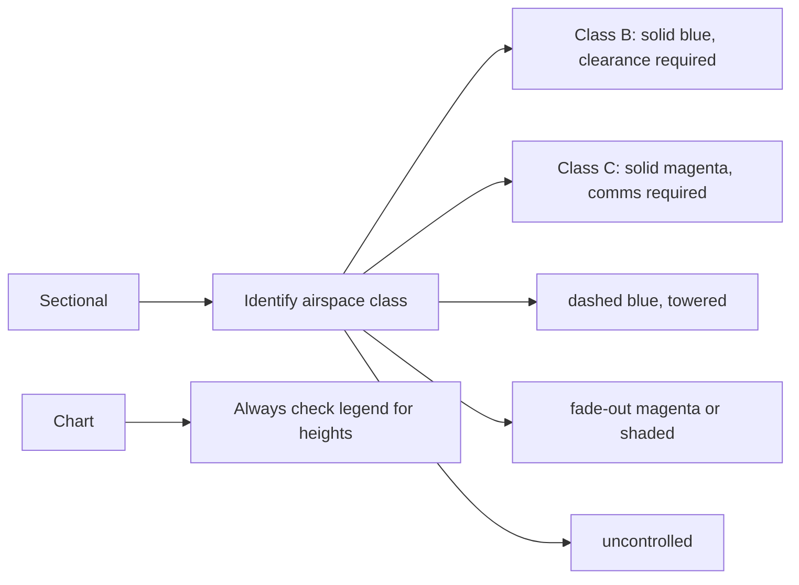

# Sectional Charts & Airspace Basics

## What it is
Sectional charts visualize airspace classes, airports, and hazards. Class B–E boundaries, floor/ceilings, and special-use airspace are plotted to guide your VFR path.

## Why it matters
You need to show the DPE that you can read the chart, identify your airspace, and explain the requirements before you enter (e.g., two-way radio in Class C, clearance for Class B).

## How it shows up on a checkride
- **Q:** “What do the solid magenta and dashed blue lines mean on a sectional?” **A:** Solid magenta is Class C outer shelf (with 4,000 ft floor), dashed blue is Class B shelf; check the legend for altitudes.
- **Q:** “How do you show compliance with Class E floor at 700 AGL?” **A:** Plan your route to stay at/above the shelf floor and maintain required visibility/ cloud clearance.
- **Q:** “Describe the clearance requirements entering a Mode C veil.” **A:** Cannot operate unless transponder with Mode C is operating and you meet the Mode C requirement (even in VFR).

## Common mistakes
- Treating Class E as uncontrolled space; you still need to obey cloud clearance/visibility minimums.
- Forgetting to watch for special-use airspace symbols; many require a call to the controlling agency.
- Misreading airport symbols and assuming the facility has a tower or fuel service.

## Diagram

## ACS Tags
- Area of Operation: Navigation (N.I)
- Task(s): N.I.A Identify airspace and chart symbols needed for VFR planning.
- Knowledge elements: Chart reading, airspace floor/ceiling, ATC requirements.

## References
- PHAK Ch 15 Airspace (Class B–G, SUAs, TFRs).
- PHAK Ch 16 Navigation (sectional chart reading, pilotage, dead reckoning).
