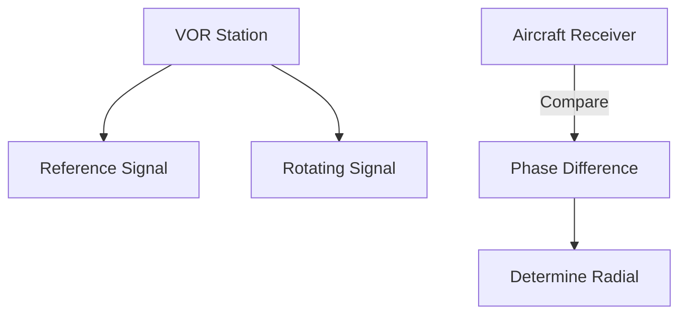

# VOR & GPS Basics

## VOR (Very High Frequency Omnidirectional Range)
- **Principle:** Ground station sends two signals. 1) Reference phase (360°), 2) Variable phase (Rotating). The receiver measures the *phase difference* to determine the radial.
- **Radials:** Radiate **OUT** from the station.
- **To/From:**
    - **FROM:** You are on the radial (e.g., 090 radial = East of station).
    - **TO:** You are on the reciprocal (e.g., 270 radial + TO = East of station).
- **Service Volumes:**
    - Terminal (T): 25 NM (1,000-12,000 AGL).
    - Low (L): 40 NM (1,000-18,000 AGL).
    - High (H): 40 NM (up to 14,500), then 100 NM.

## GPS (Global Positioning System)
- **Principle:** Triangulation (Time of arrival) from satellites.
- **Constellation:** Minimum 24 satellites.
- **Requirements:**
    - **3 Satellites:** 2D Position (Lat/Long).
    - **4 Satellites:** 3D Position (Lat/Long + Altitude).
    - **5 Satellites:** RAIM (Fault Detection).

## RAIM (Receiver Autonomous Integrity Monitoring)
- **Crucial Definition:** The GPS checks itself. If a satellite lies, RAIM detects it and warns you.
- **VFR:** Good to have.
- **IFR:** **Mandatory** for GPS use (unless WAAS).

## WAAS (Wide Area Augmentation System)
- Ground stations monitor GPS errors and beam corrections back to satellites.
- Improves accuracy from ~15 meters to ~3 meters. Allows Vertical Guidance (LPV approaches).

## Checkride Angle
- **Question:** "Can you use a VFR GPS for primary navigation?"
- **Answer:** Yes, pilotage/dead reckoning are primary, but GPS is a great tool. However, you must verify it (RAIM) and have backups (Charts).
- **Scenario:** "The VOR needle is centered with a FROM flag on 090. Where are you?"
- **Answer:** East of the station.

## Diagram: VOR Logic

## Study Drills
1. How many satellites are needed for a 3D fix? (4).
2. What is "Reverse Sensing"? (Flying TO a station with a FROM setting, needle moves opposite).

## References
- PHAK Chapter 15