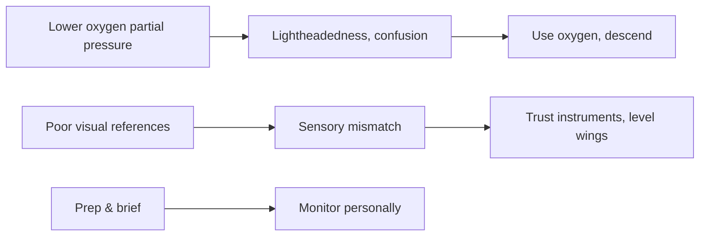

# Hypoxia & Spatial Disorientation

## What it is
Hypoxia is oxygen deprivation (hypoxic, hypemic, stagnant, histotoxic). Spatial disorientation includes vestibular and visual illusions that trick the brain into false attitudes.

## Why it matters
Explain the signs (cyanosis, poor judgment, unresponsive action) and the immediate remedy (oxygen + descend) to convince the DPE you can stay ahead of aeromedical traps.

## How it shows up on a checkride
- **Q:** “When do you use supplemental oxygen?” **A:** Above 12,500 ft MSL for more than 30 minutes, above 14,000 ft at all times, and above 15,000 ft for everyone onboard.
- **Q:** “What is the leans and how is it corrected?” **A:** After a prolonged turn, the inner ear stops sensing motion, so the airplane feels wings-level while actually banked; reference instruments and roll toward the wings-level position.
- **Q:** “How do you recover from pitch illusion on takeoff?” **A:** Trust the attitude indicator/altimeter and maintain the published climb attitude.

## Common mistakes
- Waiting for the oxygen mask before acting; start oxygen as soon as symptoms appear.
- Relying on vestibular cues instead of instrument cross-check (the leans, graveyard spiral).
- Ignoring the Time of Useful Consciousness (TUC) at altitude; have an immediate descent plan.

## Diagram

## ACS Tags
- Area of Operation: Human Factors (HF.II)
- Task(s): HF.II.A Recognize hypoxia, disorientation, and corrective actions.
- Knowledge elements: Hypoxia types, oxygen rules, illusions and instrument reliance.

## References
- PHAK Ch 17 Aeromedical factors (hypoxia, illusions, hypemic/histotoxic impacts).
