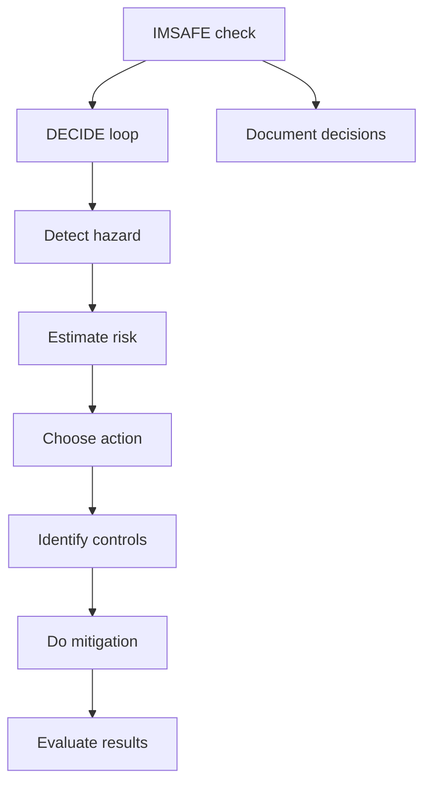

# IMSAFE & Decision Loop

## What it is
IMSAFE is your personal checklist (Illness, Medication, Stress, Alcohol, Fatigue, Emotion). Combine it with the DECIDE decision model to keep personal minimums in check.

## Why it matters
A DPE wants to hear you say “I used IMSAFE before flight” and explain how that informed your go/no-go decision.

## How it shows up on a checkride
- **Q:** “When do you stop a flight in progress?” **A:** Any IMSAFE flag, unexpected weather, or system failure triggers the DECIDE loop and may require diversion.
- **Q:** “What does the DECIDE model look like?” **A:** Detect hazards, Estimate risk, Choose action, Identify controls, Do it, Evaluate results.
- **Q:** “How do you use IMSAFE before passenger flights?” **A:** Apply IMSAFE to yourself and any PIC candidate; don’t let stress or fatigue lower your personal minimums.

## Common mistakes
- Running IMSAFE mentally without documenting or discussing it; say it out loud or log it.
- Treating medication status as irrelevant; even OTC meds can degrade judgment.
- Halting DECIDE at “Choose” without implementing the mitigation or evaluating success.

## Diagram

## ACS Tags
- Area of Operation: Human Factors (HF.I)
- Task(s): HF.I.A Apply IMSAFE and decision-making during preflight and in-flight risk management.
- Knowledge elements: IMSAFE criteria, DECIDE steps, personal minimum enforcement.

## References
- PHAK Ch 2 Aeronautical decision-making (IMSAFE, DECIDE, PAVE).
- PHAK Ch 17 Aeromedical factors (stress, fatigue, alcohol).
