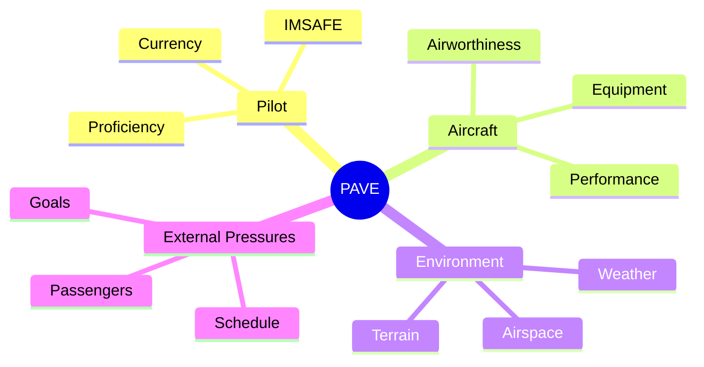

# PAVE Checklist (Preflight Risk)

## Definition
A risk assessment tool used **before** the flight to evaluate all four risk categories.

## Why It Matters
It prevents "tunnel vision" where you only look at the weather but forget that you (the pilot) are sick or the airplane has a broken radio.

## The Acronym

### **P = Pilot** (The Human)
- Use **IMSAFE**: Illness, Medication, Stress, Alcohol, Fatigue, Emotion.
- Are you current? Are you proficient?
- Do you have personal minimums?

### **A = Aircraft** (The Machine)
- Is it airworthy? (ARROW documents, inspections).
- Is it equipped for the mission? (Night, IFR, GPS?).
- Performance: Can it handle the density altitude and runway length?

### **V = enVironment** (The Situation)
- Weather: Ceiling, visibility, winds, icing.
- Terrain: Mountains, water, airports.
- Airspace: TFRs, complex airspace.
- Time of Day: Night vs. Day.

### **E = External Pressures** (The "Whys")
- "Get-there-itis": Weddings, funerals, business meetings.
- Passengers: Are they pressuring you? Are they nervous?
- **Tip:** This is the most dangerous category because it makes you ignore the other three.

## Checkride Angle
- **Scenario:** "You want to fly your family to the beach for a holiday weekend. The weather is marginal VFR. You promised your kids they'd see the ocean."
- **Analysis:**
    - **P:** Stress of disappointing family.
    - **V:** Marginal weather.
    - **E:** Huge external pressure (Holiday, Promise).
- **Decision:** Probably a No-Go.

## Diagram: PAVE Bucket

## Study Drills
1. Which letter of PAVE accounts for a pilot having a head cold?
2. Which letter accounts for a short runway at high density altitude?
3. How can you mitigate "External Pressure" from passengers? (Brief them early on "Plan B").

## References
- PHAK Chapter 2
- FAA Risk Management Handbook
