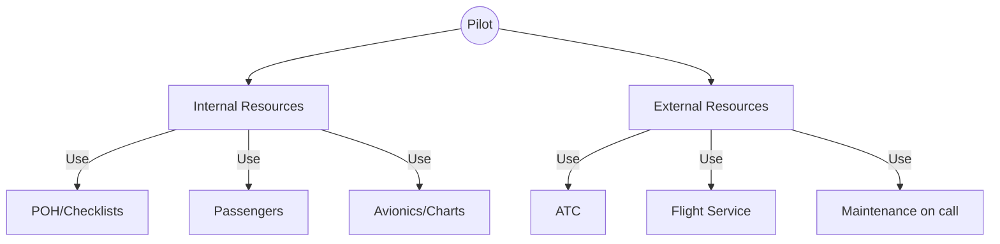

# SRM & The 5 Ps

## Definition
**Single-Pilot Resource Management (SRM)** is the art of managing all the resources (both on board the aircraft and from outside sources) available to a single pilot to ensure the successful outcome of the flight.

## The 5 Ps (SRM Check)
A scheduled "check" you do at critical phases (Preflight, Takeoff, Cruise, Descent, Approach).

1.  **Plan:** Weather, route, fuel, ATC routing changes.
2.  **Plane:** Systems, autopilot status, fuel state.
3.  **Pilot:** IMSAFE, fatigue, hunger, stress.
4.  **Passengers:** Are they sick? Nervous? Helpful?
5.  **Programming:** GPS setup, autopilot modes, radio frequencies.

## Automation Management
Modern PPL training involves glass cockpits (G1000) or EFBs (ForeFlight).
- **Rule:** Use automation to reduce workload, but **never** let it distract you.
- **Trap:** "What is it doing now?" If you don't know, **turn it off** and hand-fly.
- **Levels:**
    1.  Hand fly (Raw data).
    2.  Hand fly + Flight Director.
    3.  Autopilot (Heading/Alt).
    4.  Autopilot (Nav/VNAV).

## Checkride Angle
- The DPE will watch how you use the GPS/Autopilot.
- **Good SRM:** Programming the frequency *before* you need it. Asking ATC for help ("Workload permitting, can you give me vectors?").
- **Bad SRM:** Trying to type a waypoint while in a steep turn. ignoring a passenger who is turning green (airsick).

## Diagram: Resource Buckets

## Study Drills
1. What are the 5 Ps?
2. When should you downgrade automation? (When you are confused or it acts unexpectedly).
3. How can a passenger be a resource? (Holding charts, looking for traffic).

## References
- PHAK Chapter 2
- FAA Risk Management Handbook
