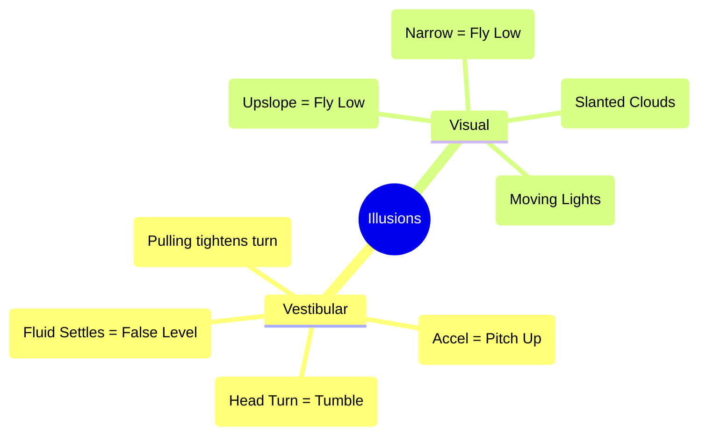

# Spatial Disorientation & Illusions

## 1. The Physiology (Why we get confused)
Our orientation relies on three systems:
1.  **Visual (80%):** Eyes. (Dominant).
2.  **Vestibular:** Inner Ear.
3.  **Proprioceptive:** "Seat of the pants" (Pressure on nerves/muscles).

### The Inner Ear (Vestibular)
*   **Semicircular Canals:** Three loops filled with fluid. They detect **Angular Acceleration** (Pitch, Roll, Yaw).
    *   *Limit:* Once a turn stabilizes (constant rate), the fluid settles, and the brain thinks you are level.
*   **Otolith Organs:** Chalky crystals on hairs. They detect **Gravity and Linear Acceleration**.
    *   *Limit:* They cannot distinguish between "Tilt" (Gravity) and "Acceleration" (Takeoff).

---

## 2. Vestibular Illusions (ICEFLAGS)
*These occur when visual cues are lost (clouds/night).*

1.  **I - Inversion Illusion:** Abrupt change from climb to straight-and-level.
    *   *Sensation:* Tumbling backwards.
    *   *Reaction:* Pilot pushes nose down -> Dive.
2.  **C - Coriolis Illusion:** Moving your head abruptly during a constant-rate turn.
    *   *Sensation:* Unbearable tumbling/disorientation on all axes.
    *   *Prevention:* Keep head still in turns. Organize cockpit to avoid reaching.
3.  **E - Elevator Illusion:** An updraft causes sudden vertical acceleration.
    *   *Sensation:* Being in a climb.
    *   *Reaction:* Pilot pushes nose down.
4.  **F - False Horizon:** Sloping clouds, city lights, or stars.
    *   *Sensation:* You align the wings with the slanted line, entering a bank.
5.  **L - Leans:** The most common. You enter a gradual turn (fluid doesn't move). You snap back to level (fluid moves).
    *   *Sensation:* You feel banked in the *opposite* direction. You lean to correct it.
6.  **A - Autokinesis:** Staring at a static light in the dark.
    *   *Sensation:* The light appears to move.
    *   *Prevention:* Don't stare. Scan.
7.  **G - Graveyard Spiral:** A prolonged constant-rate turn feels level. You notice the altimeter dropping.
    *   *Reaction:* You pull back.
    *   *Result:* Pulling back tightens the turn, increasing G-load and descent rate.
8.  **S - Somatogravic Illusion:** Rapid acceleration on takeoff (Otolith organ triggered).
    *   *Sensation:* Pitching up dangerously.
    *   *Reaction:* Pilot pushes nose down -> Controlled flight into terrain (CFIT).

---

## 3. Visual Illusions (Landing Traps)

| Condition | Illusion | Danger |
| :--- | :--- | :--- |
| **Narrow Runway** | You look **High** | You fly a **Lower** approach. |
| **Wide Runway** | You look **Low** | You fly a **Higher** approach (Flare high). |
| **Upslope Runway** | You look **High** | You fly a **Lower** approach. |
| **Downslope Runway** | You look **Low** | You fly a **Higher** approach. |
| **Featureless Terrain** | "Black Hole Approach" | You fly a **Lower** (curved) approach into the ground. |

---

## 4. The Antidote
**TRUST YOUR INSTRUMENTS.**
*   The body lies. The Gyros don't.
*   If you encounter disorientation: **Level the wings using the Attitude Indicator.** Ignore the "seat of the pants" feeling.

---

## 5. Visualizing the Traps

---

## 6. Oral Exam / Checkride Scenarios

**Q1: "You take off into a dark night over the ocean. You feel like you are tumbling backward. What is this?"**
> **A:** The **Somatogravic Illusion**. The acceleration pushes the otoliths back, mimicking a pitch-up. If I push forward, I will crash. I must trust the Attitude Indicator.

**Q2: "What is a 'Black Hole Approach'?"**
> **A:** Landing at night over water or unlit terrain. Without peripheral visual cues (depth perception), pilots tend to fly a **lower than normal approach**. I should use the VASI/PAPI or Glide Slope.

**Q3: "Explain the 'Graveyard Spiral' mechanism."**
> **A:** I am in a turn but *feel* level (fluid settled). I see altitude loss and pull back on the yoke. Since I am banked, pulling back only **tightens the turn** and increases the descent rate. Recovery: Level the wings first, then pull.

**Q4: "You look at a runway that is narrower than you are used to. How will this affect your approach?"**
> **A:** I will feel like I am **higher** than I actually am (geometry illusion). I will be tempted to fly a **lower approach**, risking hitting obstacles.

**Q5: "Why should you avoid moving your head quickly to pick up a pencil during a turn?"**
> **A:** It triggers the **Coriolis Illusion**. By moving my head in a different plane of rotation, I confuse all three semicircular canals, causing severe vertigo.

---

## References
*   **PHAK Ch 17:** Aeromedical Factors.
*   **AIM 8-1-5:** Illusions in Flight.
