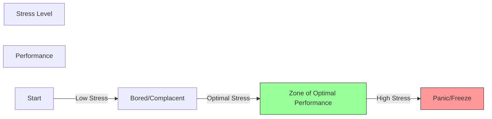

# Stress & Fatigue Management

## Definition
Physiological and psychological states that degrade pilot performance.

## Stress
The body's response to demands.
- **Acute Stress:** Short term. "Fight or Flight." (e.g., Engine quits). Good in small doses (focus), bad if it causes panic.
- **Chronic Stress:** Long term. (e.g., Financial problems, divorce). **Dangerous.** It creates a background load that lowers your threshold for mistakes.

## Fatigue
- **Acute Fatigue:** Tiredness after a long day or flight. Cured by sleep.
- **Chronic Fatigue:** Accumulated lack of rest or medical issues. Not cured by one night's sleep.

## Why It Matters
Fatigue mimics alcohol intoxication. It slows reaction time, degrades attention, and increases errors.

## The Checkride Angle
- **Scenario:** "You have a big exam at school tomorrow, you broke up with your partner yesterday, and you want to fly a solo cross-country today."
- **Answer:** No-Go. High Chronic Stress levels.
- **Question:** "Can you fly if you are taking over-the-counter allergy meds?"
- **Answer:** Generally No (or consult AME). Many cause drowsiness.

## Diagram: Performance Curve

## Study Drills
1. What is the difference between acute and chronic fatigue?
2. Why is "checking the weather" not enough to ensure a safe flight? (Because the pilot might be the hazard).

## References
- PHAK Chapter 2
- AIM Chapter 8 (Medical Facts)
