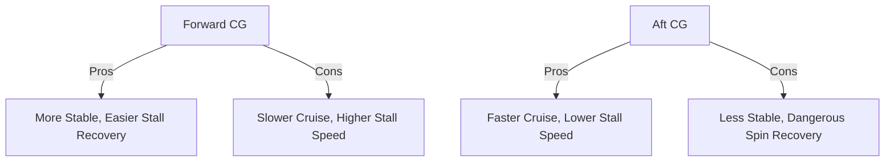

# Center of Gravity Shifts & Effects

## Why It Matters
The CG determines the stability and controllability of the aircraft.

## Forward CG (Nose Heavy)
- **Stability:** **HIGHER**. (The "arm" between CG and tail downforce is longer).
- **Cruise Speed:** **LOWER**. (Tail must create more downforce, adding drag).
- **Stall Speed:** **HIGHER**. (Wing must create more lift to support the extra tail downforce).
- **Danger:** Hard to flare on landing (elevator runs out of authority).

## Aft CG (Tail Heavy)
- **Stability:** **LOWER**. (Less tail downforce needed).
- **Cruise Speed:** **HIGHER**. (Less drag).
- **Stall Speed:** **LOWER**.
- **Danger:** **Spin Recovery becomes difficult or impossible.** (The rudder has less leverage). This is the killer.

## Checkride Angle
- **Question:** "Why is an aft CG dangerous?"
- **Answer:** It reduces longitudinal stability and makes stall/spin recovery difficult or impossible because the elevator/rudder arm is reduced.

## Diagram: Stability Teeter-Totter

## Study Drills
1. Which CG position gives better fuel economy? (Aft CG, due to less drag).
2. Which CG position is harder to flare? (Forward CG).

## References
- PHAK Chapter 9
