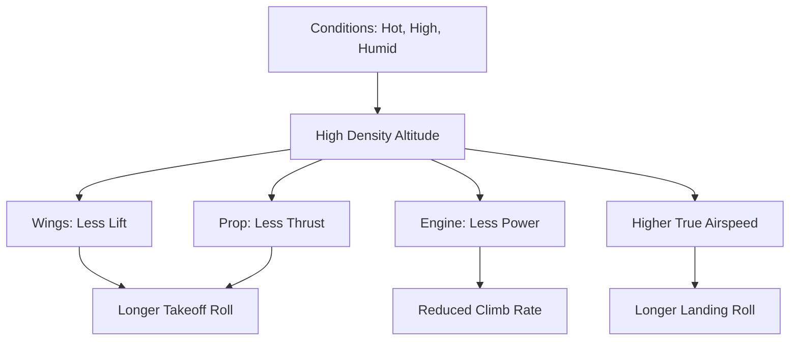

# Density Altitude Impact

## 1. What is Density Altitude?
**Definition:** "Pressure Altitude corrected for non-standard temperature."
*   It is the altitude the airplane *feels* like it is flying at.
*   **High Density Altitude = Low Performance.** (The air is thin).

---

## 2. The "Triple H" Factor
High Density Altitude is caused by:
1.  **H**igh Elevation (The airport is physically high).
2.  **H**igh Temperature (Hot air expands and becomes less dense).
3.  **H**igh Humidity (Wet air is actually *lighter* than dry air).

### The Humidity Paradox
*   **Question:** Why does humidity make air *less* dense?
*   **Physics:** Water vapor molecules ($H_2O$) weigh *less* than the Nitrogen ($N_2$) and Oxygen ($O_2$) molecules they displace.
*   **Result:** Humid air provides less lift and less oxygen for combustion than dry air.

---

## 3. Performance Penalties
If you fly on a hot, humid day at a high-elevation airport (e.g., Denver in July), expect:

| Phase | Impact | Why? |
| :--- | :--- | :--- |
| **Takeoff Roll** | **Increased** significantly | Engine produces less thrust; Wings produce less lift. |
| **Climb Rate** | **Decreased** significantly | Surplus power (Power Available - Power Required) is reduced. |
| **Landing Distance** | **Increased** | True Airspeed (TAS) is higher for the same Indicated Airspeed (IAS). You touch down faster across the ground. |
| **Service Ceiling** | **Lowered** | You may not be able to clear terrain you normally could. |

> [!IMPORTANT] **Indicated Airspeed DOES NOT Change**
> You still rotate, climb, and approach at the same **Indicated Airspeed (IAS)** numbers found in the POH.
> *   *However*, your **True Airspeed (TAS)** and **Ground Speed** will be much faster.
> *   *Illusion:* The takeoff roll feels sluggish, and the visual ground speed on landing feels frighteningly fast.

---

## 4. Turbocharged vs. Normally Aspirated
*   **Normally Aspirated:** Engine power drops roughly **3.5% per 1,000 ft** of density altitude increase.
*   **Turbocharged:** The turbo compresses the thin air, maintaining sea-level power up to the "critical altitude." (Density altitude affects the wings, but not the engine power).

---

## 5. Visualizing the Impact

---

## 6. Oral Exam / Checkride Scenarios

**Q1: "You are departing Big Bear (L35) elevation 6,700 ft. It is 30°C. How does this affect your takeoff?"
> **A:** The Density Altitude could be over 9,000 ft. My engine will produce only ~65% power. My takeoff roll might double or triple compared to sea level. I must verify the POH performance chart to ensure I can clear obstacles.

**Q2: "Does high humidity increase or decrease density altitude?"
> **A:** It **increases** density altitude. Water vapor is lighter than dry air, making the overall air mass less dense, reducing performance.

**Q3: "Will your Indicated Airspeed for rotation ($V_r$) be different at a high density altitude airport?"
> **A:** **No.** I use the same IAS. However, my True Airspeed (and ground speed) will be higher, so the runway used will be longer.

**Q4: "What is the 'Koch Chart'?"
> **A:** A nomograph used to calculate altitude and temperature effects. It typically shows percentage increase in runway length and decrease in rate of climb.

**Q5: "Why is landing at high density altitude dangerous even if you have plenty of runway?"
> **A:** Because of the higher True Airspeed. Your ground speed at touchdown is faster, increasing energy ($E=1/2mv^2$). If you try to force the plane down or brake too hard, you risk a wheelbarrow or loss of control.

---

## References
*   **PHAK Ch 11:** Aircraft Performance.
*   **PHAK Ch 4:** Principles of Flight.