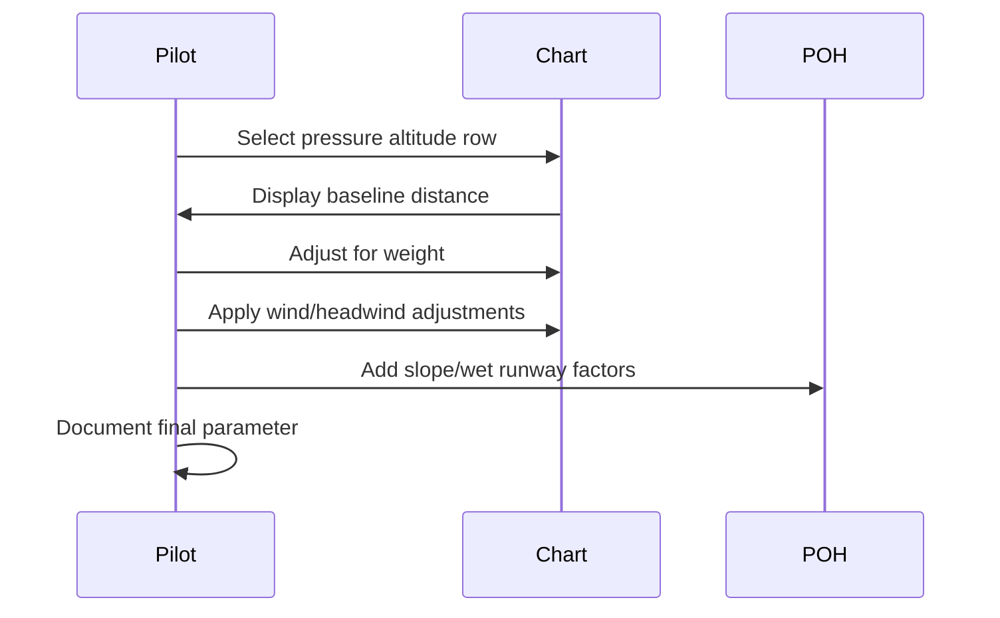

# Performance Chart Checks

## What it is
This note explains how to read takeoff, climb, and landing charts: pick temperature/pressure altitude, adjust for weight, and interpolate headwind/crosswind components.

## Why it matters
Your DPE will ask you to demonstrate a takeoff/landing distance calculation and explain how chart trends change with temperature or runway slope.

## How it shows up on a checkride
- **Q:** “How do you read a takeoff distance chart?” **A:** Start with pressure altitude, read up to the boxed distance, then adjust for gross weight and wind conditions using the margin tables.
- **Q:** “What if the runway is wet?” **A:** Apply published wet runway factors (per POH) and add extra safety margin; mention possible hydroplaning due to standing water.
- **Q:** “How does a headwind affect your distances?” **A:** A headwind reduces ground roll, so you subtract the headwind component in the chart adjustments.

## Common mistakes
- Skipping the interpolation between chart lines, which leads to underestimating distances.
- Ignoring runway slope and surface conditions when planning takeoff/landing.
- Not converting temperature to pressure altitude for chart use.

## Diagram

## ACS Tags
- Area of Operation: Performance (P.III)
- Task(s): P.III.A Compute takeoff/landing performance using pilot operating handbook charts.
- Knowledge elements: Pressure altitude, weight correction, wind/slope adjustments.

## References
- PHAK Ch 11 Aircraft performance (charts, takeoff/landing distances, density altitude adjustments).
